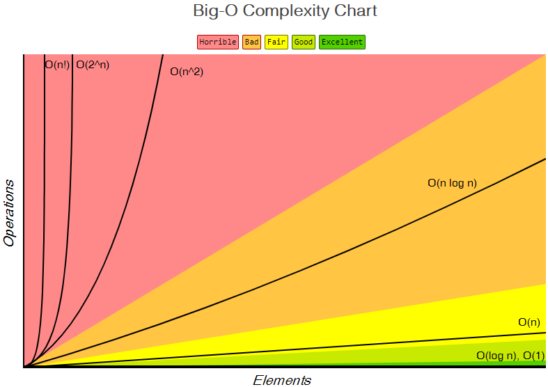

# 📅 2025/04/29
# 시간복잡도란(Time Comlexity)?
- 컴퓨터 프로그램의 입력값과 연산 수행 시간의 상간관계를 나타내는 척도
- 시간 복잡도란 크기 n의 모든 입력에 대해 걸리는 최대의 시간 (최악의 경우로 알고리즘 성능 파악)
- 시간 개념보다는 알고리즘이 실행될 때 동작하는 연산의 횟수가 몇 번인지 세는 것
- 성능평가 유형으로 best, average, worst가 있는데 이 중 최악의 경우로 알고리즘 성능을 평가

> 👉 **알고리즘을 위해 필요한 연산의 횟수**

---

### 시간복잡도 그래프 

- 자료의 수가 증가함에 따라 소요되는 처리시간 증가율을 그래프로 나타낸 것

---

## 🔍 예제
### 예제1 - O(1)
```java
if(n%2 == 0) {
    System.out.println("짝수");
} else {
    System.out.println("홀수");
}
```
=> 짝수, 홀수 두 단계에 걸쳐 진행하지만, O(1)의 시간복잡도를 가짐

### 예제2 - O(n)
```java
for(int i=0; i<n; i++) {
    System.out.println(n);
}
```
=> 이 함수는 O(n)의 시간복잡도를 가짐

---

# 공간복잡도란?

- 알고리즘 수행 시 사용하는 **메모리의 양**
- 주로 **배열, 리스트, 재귀 호출 스택** 등에서 메모리 사용량이 결정됨

### 공간 종류
1. **고정 공간**: 입력 크기와 무관한 공간 (예: 변수 선언)
2. **가변 공간**: 입력 크기에 따라 변하는 공간 (예: 배열, 동적 할당 등)

> 👉 **알고리즘을 위해 필요한 메모리의 양**

---

### ✨ 정리 포인트
- 시간복잡도: 연산 횟수 기준
- 공간복잡도: 메모리 사용량 기준
- 알고리즘 성능을 종합적으로 판단할 때 둘 다 중요함

---
---
---

# 피보나치 수열(Fibonacci Sequence) 이란?
- 0, 1, 1, 2, 3, 5, 8, 13, 21, 34 ....
- 점화식(재귀 관계)

  > **F(n) = F(n-1) + F(n-2)**  
  > **F(0) = 0, F(1) = 1**

---

## 🔍 예제
### 예제1 - 재귀(Recursive)
```java
public static int fibRecursive(int n) {
    if (n <= 1) return n;
    return fibRecursive(n - 1) + fibRecursive(n - 2);
}
```
=> 시간복잡도: O(2^n) — 비효율적
=> 공간복잡도: O(n) — 호출 스택

### 예제2 - 메모이제이션(Top-Down DP)
```java
public static int fibMemo(int n, int[] memo) {
    if (memo[n] != -1) return memo[n];
    if (n <= 1) return n;
    memo[n] = fibMemo(n - 1, memo) + fibMemo(n - 2, memo);
    return memo[n];
}

// 사용 예시
int n = 10;
int[] memo = new int[n + 1];
Arrays.fill(memo, -1);
System.out.println(fibMemo(n, memo));  // 결과: 55
```
=> 시간복잡도: O(2^n) — 비효율적
=> 공간복잡도: O(n) — memo 배열과 재귀 호출 스택

### 예제3 - 바텀업(Bottom-Up DP)
```java
public static int fibBottomUp(int n) {
    if (n <= 1) return n;
    int[] dp = new int[n + 1];
    dp[0] = 0;
    dp[1] = 1;

    for (int i = 2; i <= n; i++) {
        dp[i] = dp[i - 1] + dp[i - 2];
    }

    return dp[n];
}

```
=> 시간복잡도: O(n)
=> 공간복잡도: O(n)

### 예제4 - 공간 최적화(변수 2개만 사용)
```java
public static int fibOptimized(int n) {
    if (n <= 1) return n;
    int a = 0, b = 1;

    for (int i = 2; i <= n; i++) {
        int temp = a + b;
        a = b;
        b = temp;
    }

    return b;
}
```
=> 시간복잡도: O(n)
= > 공간복잡도: O(1) 가장 효율적

---


### ✨ 정리 포인트
- 피보나치 수열은 F(n) = F(n-1) + F(n-2)의 점화식을 따르는 문제 
- 가장 단순한 재귀 방식은 코드가 짧지만, 중복 호출로 인해 시간복잡도가 O(2^n)이라 비효율적
- 그래서 보통 메모이제이션(Top-Down) 활용하거나 반복문 기반 바텀업(Bottom-Up)  방식을 사용해 시간복잡도를 O(n)으로 개선
- 특히 실무에서는 공간까지 고려해 O(1) 공간복잡도로 구현하는 최적화 방식까지 사용해야 한다

---
---
---


# DFS(깊이 우선 탐색, Depth-First Search)란 ?
- 한 방향으로 **끝까지 탐색**하고, 더 이상 갈 수 없을 때 **되돌아가서 다른 경로**를 탐색하는 알고리즘
- **재귀** 또는 **스택(Stack)** 을 사용해서 구현.
- 주로 **그래프 탐색**, **사이클 감지**, **경로 찾기**, **백트래킹 문제** 등에 사용.

### 동작과정
1. 현재 노드를 방문하고, 방문 표시를 합니다.
2. 인접한 노드 중 방문하지 않은 노드가 있다면 그 노드로 이동하고 다시 탐색을 반복합니다.
3. 더 이상 방문할 노드가 없다면 이전 노드로 되돌아갑니다 (Backtracking).

### 시간복잡도
- **O(V + E)**

## 예제 
### 백준 2667번: 단지 번호 붙이기
Q. 정사각형 모양의 지도가 주어지며, 1은 집이 있는 곳을, 0은 집이 없는 곳을 나타냅니다. 상하좌우로 연결된 집들을 하나의 단지로 정의하고, 총 단지 수와 각 단지에 속하는 집의 수를 오름차순으로 출력하는 문제입니다.

```java 
import java.io.*;
import java.util.*;

public class Main {
    static int N;
    static int[][] map;
    static boolean[][] visited;
    static List<Integer> houseCounts;
    static int count;

    // 상하좌우 이동을 위한 배열
    static int[] dx = {-1, 1, 0, 0};
    static int[] dy = {0, 0, -1, 1};

    // DFS 메서드
    public static void dfs(int x, int y) {
        visited[x][y] = true;
        count++;

        for (int i = 0; i < 4; i++) {
            int nx = x + dx[i];
            int ny = y + dy[i];

            // 지도 범위 내에 있고, 집이 있으며, 아직 방문하지 않은 경우
            if (nx >= 0 && ny >= 0 && nx < N && ny < N) {
                if (map[nx][ny] == 1 && !visited[nx][ny]) {
                    dfs(nx, ny);
                }
            }
        }
    }

    public static void main(String[] args) throws IOException {
        BufferedReader br = new BufferedReader(new InputStreamReader(System.in));

        N = Integer.parseInt(br.readLine());
        map = new int[N][N];
        visited = new boolean[N][N];
        houseCounts = new ArrayList<>();

        // 지도 정보 입력
        for (int i = 0; i < N; i++) {
            String line = br.readLine();
            for (int j = 0; j < N; j++) {
                map[i][j] = line.charAt(j) - '0';
            }
        }

        // 전체 지도 탐색
        for (int i = 0; i < N; i++) {
            for (int j = 0; j < N; j++) {
                // 집이 있고, 아직 방문하지 않은 경우
                if (map[i][j] == 1 && !visited[i][j]) {
                    count = 0;
                    dfs(i, j);
                    houseCounts.add(count);
                }
            }
        }

        // 단지 수 출력
        System.out.println(houseCounts.size());

        // 각 단지 내 집의 수를 오름차순으로 정렬하여 출력
        Collections.sort(houseCounts);
        for (int c : houseCounts) {
            System.out.println(c);
        }
    }
}

```

### 입력 예시
```
7 
0110100 
0110101 
1110101 
0000111 
0100000 
0111110 
0111000
```
---

### 출력 예시
```
3 
7 
8 
9
```
---
---
---

# BFS(너비 우선 탐색, Breadth-First Search)란 ?
- 그래프나 트리에서 **너비 우선**으로 탐색 진행하는 알고리즘 
- 주로 **최단 경로**를 찾는 문제나, **레벨별 탐색**을 요구하는 문제에서 사용

### 동작과정
1. **큐(Queue)**에 시작 노드를 넣고 시작.
2. 큐에서 노드를 하나씩 꺼내며 그 노드와 연결된 노드를 큐에 추가.
3. 이미 방문한 노드는 다시 방문하지 않도록 **방문 체크**.
4. 큐에 탐색할 노드가 더 이상 없을 때까지 반복.

### 시간복잡도
- **O(V + E)**

## 예제 
### 백준 1926번: 그림
Q. 어떤 큰 도화지에 그림이 그려져 있을 때, 그림의 개수와 그 중 가장 넓은 그림의 넓이를 출력하는 문제입니다.​

- **그림의 정의**: 1로 연결된 부분을 하나의 그림으로 간주합니다.
- **연결의 기준**: 상하좌우로 연결된 경우만을 연결된 것으로 간주하며, 대각선은 연결로 보지 않습니다.
- **그림의 넓이**: 그림에 포함된 1의 개수입니다

```java 
import java.io.*;
import java.util.*;

public class Main {
    static int n, m;
    static int[][] paper;
    static boolean[][] visited;

    // 상하좌우 이동을 위한 배열
    static int[] dx = {-1, 1, 0, 0}; // 상, 하
    static int[] dy = {0, 0, -1, 1}; // 좌, 우

    public static void main(String[] args) throws IOException {
        BufferedReader br = new BufferedReader(new InputStreamReader(System.in));
        StringTokenizer st = new StringTokenizer(br.readLine());

        // 도화지의 세로(n)와 가로(m) 크기 입력
        n = Integer.parseInt(st.nextToken());
        m = Integer.parseInt(st.nextToken());

        paper = new int[n][m];
        visited = new boolean[n][m];

        // 도화지 정보 입력
        for (int i = 0; i < n; i++) {
            st = new StringTokenizer(br.readLine());
            for (int j = 0; j < m; j++) {
                paper[i][j] = Integer.parseInt(st.nextToken());
            }
        }

        int numberOfPictures = 0; // 그림의 개수
        int maxArea = 0; // 가장 넓은 그림의 넓이

        // 도화지를 순회하면서 BFS 수행
        for (int i = 0; i < n; i++) {
            for (int j = 0; j < m; j++) {
                if (paper[i][j] == 1 && !visited[i][j]) {
                    int area = bfs(i, j);
                    numberOfPictures++;
                    maxArea = Math.max(maxArea, area);
                }
            }
        }

        // 결과 출력
        System.out.println(numberOfPictures);
        System.out.println(maxArea);
    }

    // BFS 메서드
    public static int bfs(int x, int y) {
        Queue<Point> queue = new LinkedList<>();
        visited[x][y] = true;
        queue.offer(new Point(x, y));
        int area = 1;

        while (!queue.isEmpty()) {
            Point current = queue.poll();

            // 상하좌우로 이동
            for (int i = 0; i < 4; i++) {
                int nx = current.x + dx[i];
                int ny = current.y + dy[i];

                // 도화지 범위 내에 있고, 그림이 그려져 있으며, 아직 방문하지 않은 경우
                if (nx >= 0 && ny >= 0 && nx < n && ny < m) {
                    if (paper[nx][ny] == 1 && !visited[nx][ny]) {
                        visited[nx][ny] = true;
                        queue.offer(new Point(nx, ny));
                        area++;
                    }
                }
            }
        }

        return area;
    }

    // 좌표를 나타내는 Point 클래스
    static class Point {
        int x, y;

        Point(int x, int y) {
            this.x = x;
            this.y = y;
        }
    }
}

```

### 입력 예시
```
6 5
1 1 0 1 1
0 1 0 0 0
0 0 0 0 0
1 0 1 1 1
0 0 0 0 0
1 1 1 1 1
```
---

### 출력 예시
```
4
9
```
---
