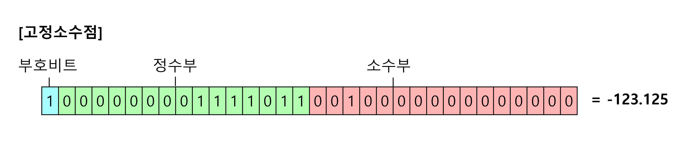
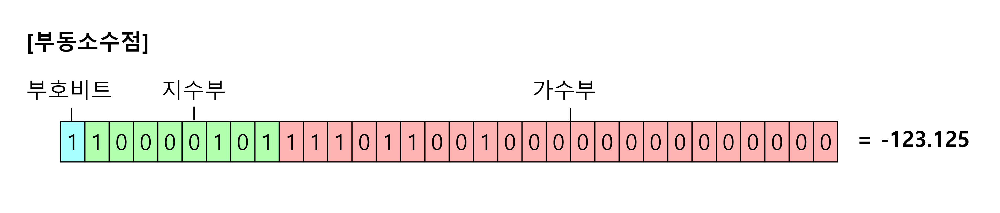
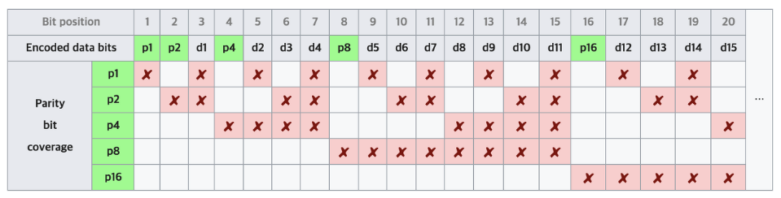

# 📅 2025/04/30
# 컴퓨터의 구성 5가지에 대해 설명해주세요.
- 입력장치(Input Unit) : 사용자의 데이터를 컴퓨터에 전달하는 장치 ex) 키보드, 마우스, 스캐너 
- 출력장치(Output Unit) : 처리된 데이터를 사용자에게 보여주는 장치 ex) 모니터, 프린터, 스피커
- 중앙처리장치(CPU) : 컴퓨터의 두뇌, 제어장치와 연산장치로 구성
- 기억장치(Storage Unit) : 데이터를 저장하는 장치. 주기억장치(RAM), 보조기억장치(HDD, SSD)로 나뉨
- 제어장치(Control Unit) : 명령을 해석하고 각 구성요소의 동작을 지시함. CPU의 일부 
- 연산장치(ALU) : 산술 및 논리 연산을 수행. CPU의 일부

---

### ✨ 정리 포인트
- 사용자가 키보드를 통해 데이터를 입력하면, 입력장치를 통해 정보가 CPU로 전달되고, CPU의 제어장치와 연산장치가 이를 처리한 뒤, 처리된 결과는 메모리에 저장되거나 출력장치를 통해 사용자에게 제공된다.
- 입력 -> 처리 -> 저장 -> 출력의 사이클 방식

---
---
---

# 중앙처리장치(CPU) 작동 원리에 대해 설명해주세요.
- 중앙처리장치는 명령어의 해석과 자료의 연산, 비교등의 처리를 제어하는 컴퓨터 시스템의 핵심 장치
- 다양한 입력 장치로부터 정보를 입력받아 처리한 후, 그 결과를 출력장치로 보내는 일련의 과정을 제어하고 조정하는 일을 수행
- CPU는 사람의 두뇌와 같이 컴퓨터의 모든 시스템을 제어, 처리하는 가장 핵심적인 장치라고 할 수 있다


## CPU의 구성요소
1. 제어장치(Control Unit, CU) : 컴퓨터 시스템의 작동을 통제하고 지시하는 장치
- 기억 장치로부터 프로그램 명령을 순차적으로 꺼내 해독하고, 해석에 따라서 명령어 실행에 필요한 제어 신호를 기억장치, 연산장치 등으로 보낸다.

2. 연산장치(Arithmetic Logic Unit, ALU) : 명령어를 실행하기 위한 마이크로 연산을 수행하는 장치
- 연산에 필요한 자료를 입력받아 산술, 논리, 관계, 이동 등 다양한 연산을 수행
- 연산에 필요한 데이터는 레지스터에서 가져오고 연산이 끝나면 다시 레지스터로 돌려준다


3. 레지스터(Register) : CPU 내에 있는 고속 기억 장치
- 명령어 주소, 코드, 연산에 필요한 데이터 연산 결과 등을 임시 저장
- 레지스터는 메모리 계층의 최상위에 위치하며 가장 빠른 속도로 접근 가능한 메모리
- 용도에 따라 범용 레지스터와 특수 목적 레지스터로 구분


--- 
## CPU의 연산
1. Fetch(인출) : 메모리상의 프로그램 카운터(PC)가 가리키는 명령어를 CPU로 인출하여 적재 
2. Decode(해석) : 명령어의 종류와 타겟 등을 해석하여 결정
3. Execute(실행) : 해석된 명령어에 따라 데이터에 대한 연산 수행
4. Writeback(쓰기) : 수행 완료된 데이터를 메모리에 기록

--- 

### ✨ 정리 포인트
- CPU는 컴퓨터의 중앙처리장치로, 모든 연산과 제어 흐름을 담당하는 핵심 부품. 사람의 두뇌처럼 작동하며, 입력된 명령어를 해석하고 처리한 후 출력 결과를 생성합니다
- 구성은 3가지 요소 제어장치, 연산장치, 레지스터로 구성되어 있으며, 명령어 사이클(Fetch->Decode->Execute)의 흐름으로 작동합니다.


---
---
---

# 캐시 메모리에 대해 설명해주세요.
- 캐시 메모리는 CPU와 메인 메모리(RAM) 사이에 위치한 **고속 임시 기억장치**로,  CPU가 자주 사용하는 데이터나 명령어를 **미리 저장**해두는 역할.

- 속도 향상 이라는 장점을 얻지만, 용량이 적기도 하고 비용이 비쌈
- CPU에는 이러한 캐시 메모리가 2-3개 정도 사용 (L1,L2,L3)


## 계층 구조
- L1 : CPU 내부에 존재 (CPU 코어당 별도 존재, 가장 먼저 접근)
- L2 : CPU와 RAM 사이에 존재 (L1 미스 시 접근)
- L3 : 보통 메인보드에 존재한다고 함 (멀티코어 CPU에서 공유)

## 동작 흐름
- 1. CPU가 명령어/데이터를 요청
- 2. 먼저 L1 캐시 확인 → 없다면 → L2 확인 → 없다면 → L3 확인
- 3. 그래도 없으면 → RAM(메인 메모리) 접근 → 해당 데이터 캐시에 저장해두고 사용

> 👉 이 과정을 **캐시 히트(Cache Hit)/ 캐시 미스(Cache Miss)**, 

---

### ✨ 정리 포인트
- 캐시 메모리는 CPU와 메인 메모리(RAM) 사이에서 동작하는 고속 임시 기억 장치입니다. 
- CPU는 매우 빠르게 작동하지만, 메인 메모리의 속도는 상대적으로 느리기 때문에 데이터를 자주 메모리에서 가져오면 병목이 발생할 수 있습니다.
- L1, L2,L3로 구분되는 계층 구조를 갖고 있으며 CPU가 요청한 데이터가 캐시에 있을 경우 히트(Hit), 없을 경우 미스(Miss)발생하고, 결국 RAM에서 데이터를 가져와 캐시에 저장합니다.


---
# 📅 2025/05/19
# 실수 표현(고정소수점 & 부동소수점)에 대해 설명해주세요
- 컴퓨터는 기계어를 사용하여 모든 정보를 0과 1의 2진수로 처리한다
- 컴퓨터는 실수를 표현하기 위해 고정 소수점과 부동 소수점 방식을 사용한다

## 고정소수점(Fixed-point)
- 소수점의 위치가 고정되어 있음
- 정수처럼 표현하면서 소수점 위치를 약속해놓는 방식

<br>

```java
00011001 → 0001.1001 (이진수) → 1.5625 (10진수)
```

<br>


- 고정 소수점 표현 방식은 부호비트, 정수부, 소수부로 구성되어있다.
- 고정 소수점 방식은 표현하는 과정은 편리하지만, 정수부와 소수부의 자릿수 제한으로 표현 가능한 수의 범위 및 정밀도가 떨어지기 때문에 잘 사용되지 않는다.


## 부동소수점(Floating-point)
- 소수점의 위치가 떠다니는 구조
- IEEE 754는 전기 전자 기술자 협회(IEEE)에서 개발한 컴퓨터에서 부동소수점을 표현하는 가장 널리 쓰이는 표준으로 실수를 저장하는 데는 32bit 또는 64bit를 사용한다.
- IEEE 754의 부동 소수점 표현 방식은 부호비트, 지수부분(exponent)과 가수부분(fraction/mantissa)으로 구성되어있다.



- 부호비트 (Sign Bit)는 맨 앞 1bit로 0은 양수를, 1은 음수를 의미한다.
- 부동소수점은 실수를 정규화 하여 지수부와 가수부로 표현한다.

<br>

```java
1. 12.375 = 1100.011 (이진수)
2. 정규화: 1.100011 × 2^3
3. 부호: 1
4. 지수: 3 + 127 = 130 → 10000010
5. 가수: 10001100000000000000000

최종: 1 | 10000010 | 10001100000000000000000
```

- 부동소수점 표현 방식은 고정소수점에 비해 복잡하지만 표현 가능한 수의 범위와 정밀도가 크다는 장점이 있다. 현재 대부분의 컴퓨터는 부동소수점 표현 방식을 사용한다.
- 다만 표현하고자 하는 수가 1/2^n의 합으로 나타내지지 않으면 이진법에서 무한소수가 되고 비트는 한정되어있기 때문에 오차가 발생한다.


# 패리티 비트 & 해밍 코드란?
- 정보의 전달 과정에서 **오류**가 생기는 것을 검사하고 수정하기 위해 패리티 비트와 해밍 코드를 사용한다

## 패리티 비트(Parity Bit)
- 패리티 비트는 정보의 전달 과정에서 오류가 생겼는지를 **검사**하기 위해 추가된 비트
- 1Byte(8bit) 데이터에서 7bit 크기의 ASCII 코드를 제외한 나머지 1bit가 패리티(Parity) 비트이다.
- 패리티비트를 포함하여 1의 개수가 짝수나 홀수개가 되도록 하여 오류를 검출한다

## 종류
| 종류                  | 설명                       |
| ------------------- | ------------------------ |
| 짝수 패리티(Even Parity) | 1의 개수가 짝수가 되도록 패리티 비트 설정 |
| 홀수 패리티(Odd Parity)  | 1의 개수가 홀수가 되도록 패리티 비트 설정 |


## 예제
# 짝수 패리티
- 1의 개수를 짝수로 맞춘다.
- 1101001의 데이터는 1의 개수가 4개(짝수) 이므로, 짝수 패리티 비트는 0이 된다.
- 데이터: 1011001 → 1의 개수: 4 (짝수) → 패리티 비트: 0
- 전송: 10110010

# 홀수 패리티
데이터: 1011011 → 1의 개수: 5 (홀수) → 패리티 비트: 1
전송: 10110111

## 해밍 코드(Hamming Code)
- 데이터 전송 중 **1비트 오류를 자동으로 감지하고 고칠 수 있는 코드**


## 해밍 코드 생성
- 8bit 기준으로 2의 n승 번째 자리인 1, 2, 4번째 자리에 패리티 비트가, 그리고 나머지에 ASCII 코드가 들어간다.
 - 아래의 이미지 처럼, pn(2^n번째 패리티비트)은 n의 간격으로 n개의 bit를 확인하여 패리티비트를 결정한다.
p2는 2, 3, 6, 7번째 비트를 확인하여 패리티비트를 결정한다.




## 자릿수 배치 규칙
- 데이터 비트 + 패리티 비트
- r = 패리티 비트 수
- m = 데이터 비트 수
- 2^r ≥ m + r + 1

## 예제
- 예시 데이터: 1 0 1 1 (총 4비트)
| 위치 | 1  | 2  | 3  | 4  | 5  | 6  | 7  |
| -- | -- | -- | -- | -- | -- | -- | -- |
| 내용 | P1 | P2 | D1 | P4 | D2 | D3 | D4 |

## 패리티 비트 계산
각 패리티 비트는 특정 위치들을 XOR해서 계산해!
✔ P1 (위치 1) → 체크 위치: 1, 3, 5, 7
값: P1, 1(D1), 0(D2), 1(D4)

계산: 1 ⊕ 0 ⊕ 1 = 0 → P1 = 0

✔ P2 (위치 2) → 체크 위치: 2, 3, 6, 7
값: P2, 1(D1), 1(D3), 1(D4)

계산: 1 ⊕ 1 ⊕ 1 = 1 → P2 = 1

✔ P4 (위치 4) → 체크 위치: 4, 5, 6, 7
값: P4, 0(D2), 1(D3), 1(D4)

계산: 0 ⊕ 1 ⊕ 1 = 0 → P4 = 0

## 최종 해밍 코드 결과
| 위치 | 1 | 2 | 3 | 4 | 5 | 6 | 7 |
| -- | - | - | - | - | - | - | - |
| 비트 | 0 | 1 | 1 | 0 | 0 | 1 | 1 |


--- 
# ARM 프로세스에 대해 설명해주세요
- ARM(Advanced RISC Machine) 프로세서는 RISC(축소 명령어 집합 컴퓨터) 기반의 저전력·고효율 CPU 아키텍처를 말한다

## ARM 프로세스 등장 배경
컴퓨터 기술이 현대화됨에 따라 고성능, 소형화를 추구하게 됐고, 80년대 아콘 컴퓨터는 마이크로컴퓨터를 설계했지만 칩 설계로 인한 한계를 느끼고 있었다.
<br>
비슷한 시기, 캘리포니아 대학교 버클리 캠퍼스의 한 프로젝트에서 한 프로그래머가 대부분의 프로그램이 명령어 세트의 작은 하위 집합만 사용한다는 것을 발견했다.
<br>
복잡하고 구현하기 어려우며 거의 사용되지 않는 명령어를 제거하여 미리 정의된 명령어의 수를 줄이게 되면, 남은 간단한 명령어는 더 빠르게 실행될 수 있고 칩의 전력과 공간을 적게 차지하게 된다는 것이다.
<br>
이를 RISC(Reduced Instruction Set Computer)아키텍처라 한다.
<br>
아콘은 새 컴퓨터에 쓸 만한 기성품 CPU를 찾을 수 없었고, 버클리 RISC 프로젝트에서 영감을 받아 직접 RISC 기반 CPU 아키텍처를 개발하기로 하는데 이것이 ARM의 시작인 Acorn RISC Machine이다.
<br>

## 특징
| 특징           | 설명                                |
| ------------ | --------------------------------- |
|  저전력       | 전력 소모가 낮아서 배터리 수명이 중요한 모바일 기기에 적합 |
|  RISC 구조   | 간단한 명령어로 빠르고 효율적인 실행 가능           |
|  고성능 대비 효율 | 파이프라이닝, 병렬 처리 등으로 성능 ↑            |
|  라이선스 기반   | ARM Holdings는 설계만 하고 라이선스를 판매     |


