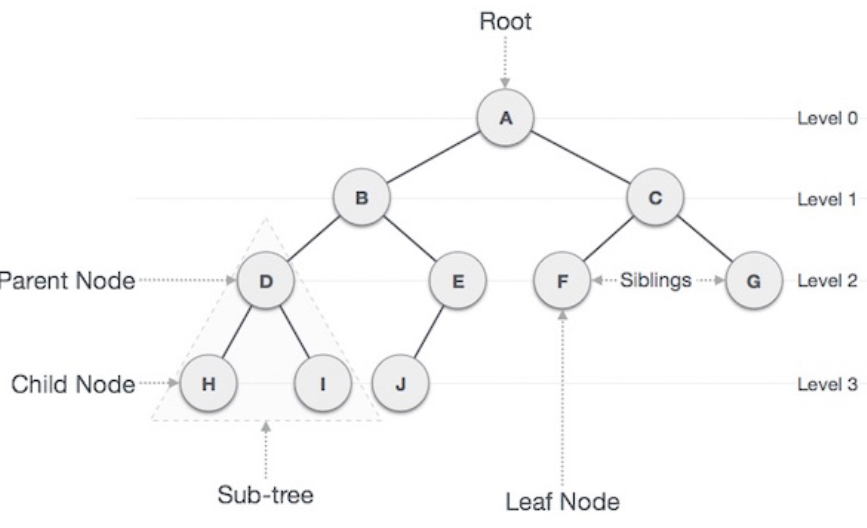
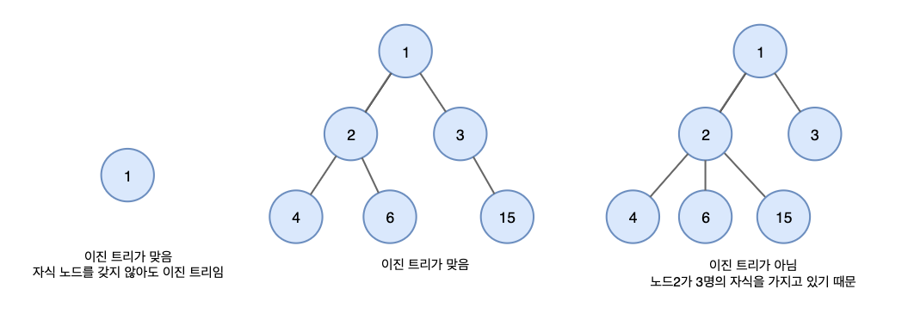
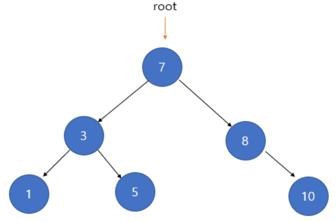
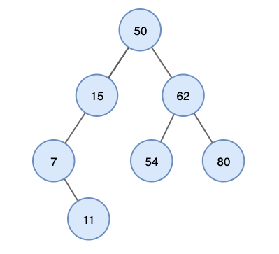
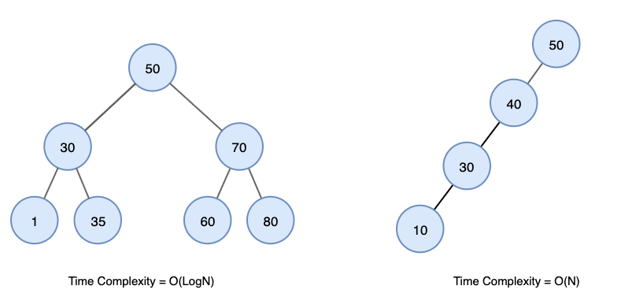
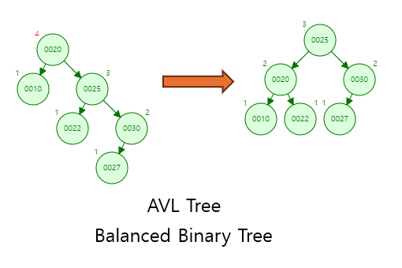

# 📅 2025/05/01
# Array와 List에 차이에 대해 설명해주세요.
## Array(배열)
- 여러 데이터를 하나의 이름으로 그룹핑해서 관리하기 위한 자료 구조
- 배열을 이용하면 하나의 변수에 여러 정보를 담을 수 있고, 반복문과 결합 하면 많은 정보를 효율적으로 처리 가능
- 배열 인덱스(Index)는 값에 대한 유일무이한 식별자가 존재

## Array(배열)의 장점
- 크기가 정해져 있음
- 인덱스를 가지며, 엘리먼트의 인덱스는 변경되지 않음
- 유관 데이터를 메모리에 순차적으로 나열할 수 있음
- 인덱스를 활용하여 빠르게 조회 가능 (O(1))
- cache hit의 가능성이 커져서 성능에 큰 도움

## Array(배열)의 단점
- 삽입, 삭제가 어렵다
- 고정된 크기를 갖는다
- 인덱스를 이용하여 데이터를 가져오려면 데이터에 대한 인덱스 값이 고정되어야 한다 (삭제된 엘리먼트의 공간이 그대로 남는다 -> 메모리 낭비)
---
## List(리스트)
- 배열이 가지고 있는 인덱스 장점을 버리고, 대신 빈틈없는 데이터의 적재라는 장점
- 엘리먼트들 간의 순서가 핵심. 따라서 리스트를 다른 말로는 시퀀스(sequence)라고도 불림. 순서가 있는 데이터 모임
- 빈 엘리먼트는 허용하지 않음
- 순차성을 보장하기 때문에 cache hit가 어렵다
- 데이터 갯수가 확실, 자주 사용된다면 array가 더 효율적
- 리스트에 대한 효용은 어떤 언어를 사용하느냐에 따라 달라진다.

## List(리스트)의 장점
- 크기가 고정되어 있지 않음
- 사용한 메모리르 재사용할 수 있어 메모리의 낭비가 적다

## List(리스트)의 단점
- 인덱스를 통해 값에 바로 접근이 불가능하여 탐색이 순차적으로 이루어진다 
- 주소를 지정할 수 있는 별도의 메모리 공간을 필요로 한다

---

### ✨ 정리 포인트
- Array는 고정 크기의 연속된 메모리 구조로 빠른 접근이 장점이지만, 삽입/삭제가 비효율적이고 크기 변경이 어렵습니다. 
- 반면 List는 동적으로 크기 조절이 가능하고 삽입/삭제가 유연하지만, 구조에 따라 접근 속도가 느릴 수 있으며, 추가 메모리를 사용할 수 있습니다. 
- Java에서는 상황에 따라 ArrayList나 LinkedList를 선택적으로 사용합니다.
- ex) Java의 int[] arr = new int[10]; → 고정 크기 배열 / Java의 List<Integer> list = new ArrayList<>(); → 동적 크기 확장 가능

---
---

# Linked List란?
- Linked List(연결 리스트)는 데이터를 순차적으로 저장하면서, 각 요소가 다음 요소의 주소를 참조하는 동적 자료 구조.

## Linked List 특징
- 데이터가 메모리상 연속되지 않아도 됨
- 각 요소고 다음 요소의 참조(링크)를 가지고 있음
- 크기가 가변적.
- 인덱스 접근은 불가능 -> 순차 탐색 필요

### ✨ 정리 포인트
- Linked List는 각 요소가 포인터를 통해 다음 요소를 가리키는 구조로, 메모리 상 연속되지 않아도 되며 삽입/삭제에 유리한 자료구조입니다. 
- 대신 인덱스 기반 접근이 어렵고, 포인터를 위한 추가 메모리를 사용합니다. 
- Java에서는 LinkedList 클래스로 제공되며, 큐나 덱처럼 양쪽 삽입/삭제가 잦은 구조에 적합합니다.

---
---
# 3. List와 Set의 차이에 대해 설명해주세요.
- List는 순서가 있는 데이터의 집합으로, 중복된 값을 허용하며 인덱스로 요소에 접근할 수 있습니다. 
- 반면 Set은 중복된 값을 허용하지 않고, 구현체에 따라 순서를 보장하지 않거나 정렬된 순서를 유지하기도 합니다. 
- 예를 들어, 중복을 제거해야 하는 경우에는 Set이 적합하고, 순서를 보장하고 싶다면 List를 사용합니다.

# 📅 2025/05/20
# 스택(Stack) & 큐(Queue) & 덱(Deque)에 대해서 설명해주세요.

# 스택(Stack)
- 스택은 후입선출(Last In First Out - LIFO)의 특성
- Push(입력)과 Pop(출력) 두 가지 기능을 가지고 있으며, Pop 시에 스택에 제일 늦게 입력한 부분이며 위쪽인 Top에서 Pop하여 출력한다
- 스택을 이해하기 위한 예시로 책상에 책을 쌓아둘 때와 같이 하나 하나 위로 점점 쌓아가고 ( Push / 입력 ), 책을 꺼낼 때에는 맨 위(Top)에서 부터 하나씩 꺼내 읽는다( Pop / 출력 ).
- 스택은 선형구조이고 입력 시 차곡차곡 쌓아올리며, 출력할 때에는 마지막으로 쌓아올린 맨위에 있는 것을 꺼내 사용한다.

# 큐(Queue)
- 큐는 선입선출(First In First out - FIFO)의 특성
- Push(입력)과 Pop(출력) 두 가지 기능을 가지고 있으며, Push 동작에는 Rear라고 불리는 가장 마지막 부분에 삽입하고, Pop 동작에는 Front라 불리는 가장 먼저 입력된 자료가 있는 앞쪽에서 출력한다
- Queue의 뜻은 표 같은것을 구매하기 위해 줄 서는 것을 의미하는데, 줄을 서려면 맨 마지막 줄 선 사람 뒤(Rear)에 서는데 이것을 Push(입력)이라 할 수 있고, 가장 먼저 줄을 선 사람(Front)이 표를 구매하고 줄을 나가는 것을 Pop(출력)이라고 할 수 있다.
- 큐를 이해하기 위한  다른 예시로 터널을 생각하면 이해가 쉽다. 터널은 한 쪽으로 통행하는데 차량이 통과할  때 한 쪽 입구(Rear) 로 들어가고(Push),  다른 출구(Front)로 나오게 된다(Pop).

# 덱(Deque)
- 덱은 앞뒤로 모두 입력, 출력이 가능한 (Double-ended Queue)로써 큐를 활용하여 만들어진 자료구조
- 덱은 Push(입력)와 Pop(출력)이 Fornt와 Rear에서 모두 가능하다
- 덱(Deque)은 Push와 Pop이 비교적 자유롭다는 장점을 활용하여, 스택과 큐 구현이 모두 가능하다.
- 덱의 제일 큰 장점은 활용 가능 범위가 넓다는 것이다. Rear에서 Push연산과 Pop연산만 시행할 시에 스택(Stack)을 구현할 수 있고, Rear에서 Push연산과 Front에서 Pop연산시 큐(Queue)를 구현 할 수 있다.

# Heap, Priority Queue에 대해서 설명해주세요

# 힙(Heap)
- 힙(Heap)은 스택(Strack), 큐(Queue), 덱(Deque)처럼 선형구조가 아닌 **트리의 일종으로 비선형 구조**
- 힙(Heap)은 최대 힙(Max-Heap), 최소 힙(Min-Heap)으로 분류할 수 있는 완전 이진 트리이다.
- 힙(Heap)은 스택(Strack), 큐(Queue)와 같이 자료가 입력된 순서와 출력 시 먼저 입력이 된 자료거나 나중에 입력이 된 자료와 같이 순서가 중요한 것이 아닌, **최댓 값 또는 최솟 값을 찾을 때** 유용하게 활용된다.
- 힙(Heap)의 단점으로는 스택(Strack), 큐(Queue)와 같이 순서변화가 없어 입출력에서 단순한 구조가 아닌, **입/출력 시에 다시 재 정렬 해야한다는 단점**이 있다. 
- **부모 노드가 자식 노드보다 항상 크거나 작다는 조건을 만족하는 트리 구조.**

## 우선순위 큐(Priority Queue)
- 우선순위 큐는 들어간 순서에 상관없이 우선순위가 높은 데이터가 먼저 나오는 것을 말한다.

## 우선순위 큐 속성
1. 모든 항목에는 우선순위가 있습니다.
2. 우선 순위가 높은 요소는 우선 순위가 낮은 요소보다 먼저 queue에서 제외됩니다.
3. 두 요소의 우선 순위가 같으면 queue의 순서에 따라 제공됩니다.

## 예제
- 4 → 8 → 2 순으로 데이터가 들어간다고 했을 때 큐와 우선순위 큐의 처리 순서는 다음과 같습니다.
(여기서 높은 값이 높은 우선순위를 갖는다고 가정하겠습니다.)

- input : 4 → 8 → 2
- 큐 : 4 → 8 → 2
- 우선순위 큐 : 8 → 4 → 2

# Tree, Binary Tree, BST, AVL Tree

# 트리(Tree)
- 트리는 그래프(Graph)의 한 형태로, 계층적인 관계를 표현하는 비선형 자료구조이다.

## 트리의 요소
기본적으로 트리는 그래프이므로 **노드(Node)**와 **간선(Edge)**으로 구성된다
- 노드(Node): 트리를 구성하는 기본 요소로, 데이터와 다른 노드와의 연결 정보를 가지고 있다
- 간선(Edge): 노드와 노드를 연결하는 선이다. 부모 노드와 자식 노드를 연결한다.

트리는 그래프의 한 케이스로, 루트 노드로부터 하위에 자식 노드를 두어 계층적인 구조를 가지고 있다
- 루트(Root) 노드: 최상위 노드로 유일하다.
- 리프(Leaf) 노드: 자식 노드가 없는 노드를 말한다.
- 깊이(depth) : 루트에서 어떤 노드까지의 간선 수로, 레벨(Level)이라고도 한다.
- 높이(height) : 트리의 최대 깊이

## 트리의 특징
- 부모 자식 관계를 가지는 계층형 자료구조 로, 방향성이 있으며, 모든 자식 노드는 하나의 부모 노드만 갖는다.
- 두 개의 노드 사이에는 한 개의 간선을 가지며 사이클(Cycle)이 존재하지 않아 최소 연결 트리 라고 부르기도 한다.
- 트리 내에 하위 트리(Sub Tree)가 있는 재귀적 자료구조 이다.
- 노드가 n개인 트리는 항상 n-1개의 간선을 가진다.

# 이진트리(Binary Tree)
- 모든 노드들이 둘 이하의 자식을 가진 트리이다.

# 이진 탐색 트리(Binary Search Tree)
- 정렬된 이진 트리
- 노드의 왼쪽 자식은 부모 노드보다 작은 값, 오른쪽 자식은 부모 노드보다 큰 값을 갖는다.

## 이진 탐색 트리 특징
1. BST의 Inorder Traversal을 수행하여 모든 키를 정렬된 순서로 가져올 수 있다.

위 트리의 inorder traversal의 결과는 다음과 같다.
7, 11, 15, 50, 54, 62, 80

2.  BST의 검색에 대한 시간복잡도는 균형 상태이면 O(logN)의 시간이 걸리고 불균형 상태라면 최대 O(N) 시간이 걸립니다.
 

# AVL Tree
- AVL Tree는 균형 이진 탐색 트리(Self-balancing Binary Search Tree)의 일종으로, 트리의 높이를 항상 일정하게 유지하여 탐색, 삽입, 삭제 연산에서 O(log n)의 성능을 보장하는 자료구조입니다.
- AVL 트리는 삽입이나 삭제가 발생할 때마다 트리의 균형을 유지하기 위해 회전(Rotation) 연산을 사용합니다. 이러한 균형 유지 메커니즘 덕분에, 비균형 트리로 인한 성능 저하를 방지할 수 있습니다.

## AVL Tree 특징
1. 균형 인수
- AVL 트리에서는 각 노드에 대해 왼쪽 서브트리와 오른쪽 서브트리의 높이 차이를 균형 인수라고 합니다. 균형 인수는 -1, 0, 1을 유지해야 합니다.
- 0: 왼쪽과 오른쪽 서브트리의 높이가 동일함.
- 1: 왼쪽 서브트리의 높이가 오른쪽보다 1 크다는 의미.
- -1: 오른쪽 서브트리의 높이가 왼쪽보다 1 크다는 의미.
- 쉽게 생각하면 왼쪽 높이 - 오른쪽 높이입니다.

2. 균형을 깨트리는 연산
- 삽입 또는 삭제 시, 특정 노드에서 균형 인수가 2 이상이 되면 트리의 균형이 깨진 것입니다.
- 이 경우 회전 연산(Rotation)을 통해 트리의 균형을 유지합니다.

3. 회전 연산
- 트리가 균형을 유지하지 못할 때, 회전 연산을 통해 균형을 되찾습니다.
- AVL 트리의 회전 연산은 단순 회전(Single Rotation)과 이중 회전(Double Rotation)으로 나뉩니다.
- 단순 회전(Single Rotation): 트리가 한쪽 방향으로만 치우친 경우 사용. (LL회전, RR회전)
- 이중 회전(Double Rotation): 두 방향으로 치우친 경우 사용. (LR회전, RL회전)

4. 시간 복잡도:
- 탐색, 삽입, 삭제 연산 모두에서 O(log n)의 성능을 보장합니다.
- 회전 연산이 추가되지만, 트리의 높이를 일정하게 유지하므로 전체적인 성능은 여전히 뛰어납니다.

- 참고:  https://velog.io/@dankj1991/Tree-AVL-Tree

# 📅 2025/06/04
# BST의 최악의 경우의 예와 시간복잡도에 대해서 설명해주세요
- BST의 최악의 경우는 트리가 한쪽으로만 치우쳐진(skewed) 형태를 가질 때 발생합니다. 이는 노드들이 삽입되는 순서에 따라 결정됩니다.

## 예시 1: 오름차순으로 정렬된 데이터 삽입
데이터: [1, 2, 3, 4, 5]를 순서대로 BST에 삽입한다고 가정해봅시다.

1. `1` 삽입
2. `2` 삽입 (1보다 크므로 오른쪽 자식) 
3. `3` 삽입 (2보다 크므로 오른쪽 자식)
4. `4` 삽입 (3보다 크므로 오른쪽 자식)
5. `5` 삽입 (4보다 크므로 오른쪽 자식)
이런 트리는 마치 **단일 연결 리스트(Singly Linked List)**처럼 보입니다.

## BST의 최악의 경우 시간 복잡도
BST의 주요 연산(탐색, 삽입, 삭제)의 시간 복잡도는 트리의 **높이(height, h)**에 비례합니다.

- 탐색(Search): 특정 값을 찾기 위해 루트부터 시작하여 값을 비교하며 내려갑니다. 최악의 경우, 찾는 값이 트리의 가장 깊은 곳에 있거나 존재하지 않을 경우 트리의 높이만큼 비교해야 합니다.
- 삽입(Insertion): 새로운 노드를 삽입할 위치를 찾기 위해 탐색 과정과 유사하게 진행됩니다. 최악의 경우, 트리의 높이만큼 내려가야 합니다.
- 삭제(Deletion): 삭제할 노드를 찾고, 삭제 후 트리의 속성을 유지하기 위해 적절한 노드로 대체합니다. 이 과정 또한 탐색 및 일부 재정렬을 포함하므로 트리의 높이에 비례합니다.

따라서, **최악의 경우(편향 트리)**에는 트리의 높이 h가 노드의 개수 N과 같아집니다 (h=N).

- 삽입, 삭제, 탐색 연산의 시간 복잡도: O(h)=O(N)

# 해시(Hash)란?
- 해시(Hash)는 컴퓨터 과학에서 데이터를 관리하고 저장하는 데 사용되는 중요한 개념이자 기술입니다. 간단히 말해, **임의의 길이의 데이터를 고정된 길이의 데이터로 매핑하는 과정** 또는 그 그 결과를 의미. 이 과정을 수행하는 함수를 **해시 함수(Hash Function)**라고 하고, 그 결과로 나오는 고정된 길이의 값을 **해시 값(Hash Value), 해시 코드(Hash Code), 다이제스트(Digest)** 라고 부른다.

# B-Tree & B+Tree 란?
# B-Tree vs B+Tree 비교

| 특징             | B-Tree                                       | B+Tree                                          |
| :--------------- | :------------------------------------------- | :---------------------------------------------- |
| **데이터 저장** | 모든 노드 (내부 노드 & 리프 노드)            | **리프 노드에만 저장** (내부 노드는 키와 포인터) |
| **키 중복** | 없음 (일반적으로)                            | **내부 노드에 중복 키 허용** (탐색 가이드 역할) |
| **리프 노드 연결** | 없음                                         | **연결 리스트로 연결** |
| **검색 효율 (특정 값)** | $O(\log N)$ (Best Case는 더 빠를 수 있음)  | 항상 $O(\log N)$ (리프까지)                     |
| **검색 효율 (범위/순차)** | 비효율적                                     | **매우 효율적** (연결 리스트 사용)              |
| **디스크 I/O** | 적음 (높이 낮음)                             | **더 적음** (높이가 더 낮을 수 있음)            |
| **주요 사용처** | 일부 파일 시스템, 일반적인 인덱싱            | **대부분의 데이터베이스 인덱스 (MySQL InnoDB 등)**, 파일 시스템 |