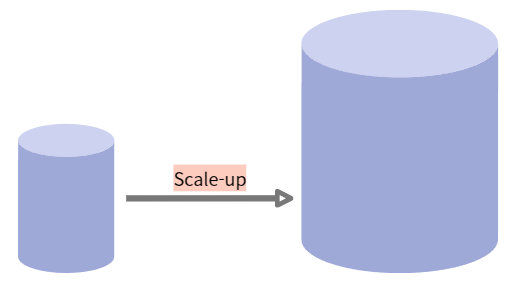
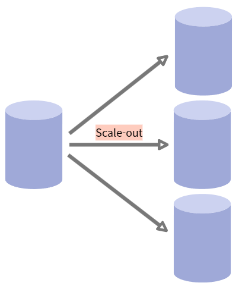

# 📅 2025/05/02
# 키(Key)에 대해 설명해주세요.
- 키는 데이터베이스에서 조건에 만족하는 관계의 행을 찾거나 순서대로 정렬할 때 다른 행과 구별할 수 있는 유리한 기준이 되는 속성의 집합이다.

## 키(Key)의 종류
- 슈퍼 키 : 유일성을 만족하는 키. relation 내에 있는 속성들의 집합으로 구성된 키. (유일성: 하나의 키로 특정 행을 바로 찾아낼 수 있는 고유한 데이터 속성)
- 후보 키 : 유일성과 최소성을 만족하는 키. (최소성: 키를 구성하는 속성들 중 가장 최소로 필요한 속성들로만 키를 구성하는 성질)
- 기본 키 : 후보키들 중에서 하나를 선택한 키로 유일성과 최소성을 만족하는 속성. NULL 불가능, 중복된 값 X, 오직 1개만 저장 가능
- 대체 키 : 후보키가 두 개 이상일 경우 그 중에서 하나를 기본키로 지정하고 남은 후보키들을 대체키. 
- 복합 키 : 하나의 속성으로는 기본키가 될 수 없는 둘 이상의 컬럼을 묶어서 식별자로 정의.
- 외래 키 : 테이블이 다른 테이블의 데이터를 참조하여 테이블간의 관곌르 연결. 

---

# JOIN에 대해 설명해주세요.
- JOIN은 데이터베이스에서 두 개 이상의 테이블을 연결하여 하나의 결과 테이블로 만드는 것을 의미. 
- 데이터베이스에서 테이블을 분리하여 '데이터 중복을 최소화'하고 '데이터의 일관성'을 유지하기 위함

## JOIN 의 종류
- INNER JOIN : 교집합의 개념 
- OUTER JOIN(LEFT, RIGHT, FULL) : 특정 테이블 기준으로, FULL의 경우는 합집합(모든 데이터 선택) 
- CROSS JOIN : 두 테이블의 행의 개수의 곱
- SELF JOIN : 자기 자신과 조인

---  

# SQL Injection이란?
- 웹 사이트의 보안상 허점을 이용해 특정 SQL 쿼리 문을 전송하여 공격자가 원하는 DB의 중요한 정보를 가져오는 해킹 기법

## SQL Injection 대응
- 1. 입력 값에 대한 검증 필요
- 2. Prepared Statement 구문 사용 : 변수를 문자열로 바꾸라는 것으로 안전하다. 사용자의 입력 값이 데이터베이스의 파라미터로 들어가기 전에 DBMS가 미리 컴파일하여 실행하지 않고 대기한다. 그 후 사용자의 입력 값을 문자열로 인식하게 하여 공격 쿼리가 들어간다고 하더라도, 사용자의 입력은 이미 의미 없는 단순 문자열 이기 때문에 전체 쿼리문도 공격자의 의도대로 작동하지 않는다.
- 3. Error Message 노출 금지 : 에러 발생한 쿼리문 내용을 반환하면 쿼리문이 노출되기 때문에
- 4. 웹 방화벽 사용 : 소프트웨어 형(서버 내에 직접 설치), 하드웨어 형(네트,워크 상에서 서버 앞 단에 직접 하드웨어 장비로 구성), 프록시 형(DNS 서버 주소를 웹 방화벽으로 바꾸고 서버로 가는 트래픽이 웹 방화벽을 먼저 거치도록 하는 방법.)

# 📅 2025/05/21
# RDBMS vs NoSQL에 대해 설명해주세요
# RDBMS(Relational Database Management System)
- 관계형 데이터베이스 관리 시스템
- 관계형 데이터 모델을 기초로 두고 **모든 데이터를 2차원의 열과 행(테이블)의 형태로 표현**
- 외래 키(foreign key)를 사용하여 테이블 간 join이 가능
- ACID(Atomicity, Consistency, Isolation, Durability) 원칙을 기본으로 구성

## RDBMS 장점
- 정해진 스키마에 따라 데이터를 저장해야 해서 명확한 데이터 구조 보장 (데이터 정합성)
- 각 데이터를 중복 없이 한 번만 저장 가능 (데이터 무결성)

## RDBMS 단점
- 테이블 간 관계를 맺고 있어 시스템이 커질 경우 JOIN문이 많은 복잡한 쿼리 발생 가능
- 성능 향상을 위해 Scale-Up만 지원 -> Scale-Out이 불가능하기 때문에 처리 비용이 기하급수적으로 커질 수 있음
- 스키마로 인해 데이터가 유연하지 못함 -> 나중에 스키마가 변경될 경우 번거롭고 어려움

### Scale-up
- 기존의 서버를 보다 높은 사양으로 업그레이드하는 것
- 하나의 서버의 능력을 증강하기 때문에 수직 스케일링(vertical scaling)이라고도 함

### Scale-out
- 장비를 추가해 확장하는 방식
- 서버를 추가로 확장하기 때문에 수평 스케일링(horizontal scaling)이라고도 함
- 비슷한 사양의 서버를 추가로 연결해 처리할 수 있는 데이터의 용량 증가뿐만 아니라 기존 서버의 부하를 분담해 성능도 향상

# NoSQL(Not Only SQL)
- RDBMS의 성능과 한계를 극복하기 위해 등장
- ACID 특성을 제공하지 않지만 뛰어난 확장성이나 성능 등의 특성을 가짐
- 테이블 간의 관계 정의가 X, JOIN 필요 X

## NoSQL 모델 종류
1. Key-Value DB
- Key-Value 방식으로 데이터를 저장 
- Key값은 모든 데이터 타입을 수용할 수 있고, 중복되지 않는 유니크한 값
- 메모리 기반으로 빠르게 데이터를 읽어올 수 있음 
ex) Redis, AWS Dynamo DB

2. Document DB
- 비정형 대량 데이터를 저장하기 위한 방식
- Key-Value에서 확장된 방식으로, key-Document 형태로 저장
- Document는 계층적인 데이터 타입(JSON,XML)으로 저장됨
- JSON 타입을 사용하므로 HTTP 기반의 웹 서버의 경우 데이터를 편리하게 주고받을 수 있음
ex) MongoDB, Couch DB

3. Wide Column DB
- Row가 아닌 Column 위주로 데이터를 저장하는 방식
- Key, Value와 유사한 형태의 Column-family Model
- 데이터가 내부에서 Key를 기준으로 오름차순 저장
- 이전의 모델들이 key-value값을 이용해 필드를 가졌다면, 이 모델은 키에서 필드를 결정
ex) HBase, Hypertable

4. Graph DB
- 객체와 관계를 그래프 형식의 데이터로 저장하기 위한 방식
- 데이터를 Node와 Edge, Property와 함께 그래프 구조를 사용하여 데이터를 저장
- SNS, Networ Diagrams 등과 SNS에서 함께 아는 친구 찾기, 추천 등 연관된 데이터를 추천해주는 엔진이나 패턴 기능에 사용
ex) Neo4j

## NoSQL 장점
- 스키마 없어 유연하고 자유로운 데이터 구조 (언제든 저장된 데이터 조정과 새로운 필드 추가가 가능)
- 성능 향상을 위해 Scale-up/Scale-out이 모두 가능 (데이터 분산이 용이, RDBMS에 비해 대용량의 데이터 저장 가능)

## NoSQL 단점
- 스키마가 존재하지 않아 데이터의 일관성이 존재하지 않고 데이터 구조를 결정하기 어려울 수 있음
- 데이터의 중복 발생 가능 

# 정규화(Nomalization)란?
- SQL 정규화란 데이터베이스 설계 과정에서 **중복 데이터를 최소화**하고 **데이터 일관성을 유지**하기 위한 중요한 원칙 중 하나이다. 정규화는 데이터베이스 테이블을 여러 테이블로 분할하고, 이러한 테이블 간의 관계를 정의함으로써 데이터를 더 효율적으로 저장하고 관리하는 방법

## 정규화의 목적
- 중복 데이터 제거 
- 데이터 무결성 유지

## 정규화의 절차
1. 제 1정규형: 1NF(First Normal Form)
- 원자값(Atomic Values) : 각 열은 원자적인 값(더 이상 분해할 수 없는 값, 하나의 값)을 가져야한다.
- 고유한 식별자(Unique Identifier) : 각 행은 고유한 식별자(primary key)를 가져야 한다.
- 중복 데이터 제거(No Duplicate Rows) : 동일한 데이터가 중복으로 나타나지 않아야 한다.

2. 제 2정규형 : 2NF(Second Normal Form)
- 1NF 만족: 1NF를 만족해야 한다.
- 부분 종속성 제거: 테이블의 모든 컬럼이 완전 함수적 종속을 만족해야 한다. 테이블에서 기본키가 복합키(키1,키2)로 묶여있을 때, 두 키 중 하나의 키만으로 다른 컬럼을 결정 지을 수 있으면 안된다.

3. 제 3정규형 : 3NF(Third Normal Form)
- 데이터베이스 정규화의 세 번째 단계로, 2NF를 만족하면서 이행 종속성을 제거하는 것이 목적이다.
- 2NF 만족
- 기본키 의존 : 기본키가 아닌 속성들은 기본키에 의존해야 한다.

4. BCNF (Boyce-Codd Normal Form)
- 주로 다중 후보 키와 관련된 테이블에서 발생한다.
- 3NF 만족 
- 후보 키에 대한 함수 종속성 : 모든 결정자가 후보키가 되도록 테이블을 분해하는 것. 즉, 후보키 집합에 없는 칼럼이 결정자가 되어서는 안된다는 뜻.

5.  제 4정규형 : 4NF (Fourth Normal Form)
- 보통 정규화는 BCNF 까지만 하는 경우가 많다. 그 이상 정규화를 하면 정규화의 단점이 나타날 수 있다.
- 다치 종속성 (Multivalued Dependency) : 다치 종속성은 테이블의 열들 간에 다중 값 종속성을 나타낸다. 즉, 하나의 키(주요 키 또는 후보 키)에 대한 여러 개의 값 집합이 있을 때 다치 종속성이 발생한다.
- 후보 키의 독립성 : 테이블이 여러 개의 후보 키를 가질 때, 한 후보 키의 값을 변경할 때 다른 후보 키에 영향을 주어서는 안 된다.

6. 제 5정규형 : 5NF (Fifth Normal Form)
- 조인 종속성을 처리하기 위해 추가적인 정규화 단계로, 복잡성과 성능 문제로 현실적으로 잘 사용되지 않는다.
- 4NF 만족
- 조인 종속성 (Join Dependency) : 조인 종속성이 없어야 하고, 조인 연산을 했을 때 손실이 없어야 한다.

## 정규화의 단점
- 테이블의 분해로 인해 데이터베이스 내의 JOIN 연산이 많아져, 쿼리 성능이 저하될 수 있다. 특히 대규모 데이터베이스에서는 조인 비용이 높아질 수 있다.
- 따라서, 처리 성능이 중요한 데이터에 대해 '반정규화(De-normalization)'하기도 한다.

## 반정규화란?
- 데이터베이스의 성능 향상을 위하여, 데이터 중복을 허용하고 조인을 줄이는 데이터베이스 성능 향상 방법이다.
- 반정규화는 조회(select) 속도를 향상시키지만, 데이터 모델의 유연성은 낮아진다.

# 인덱스(INDEX)란?
- 인덱스란, 데이터베이스에서 데이터를 더 빠르게 검색할 수 있게 해주는 자료구조이다.

## 인덱스의 종류
### 클러스터형 인덱스(Clustered Index)
- 클러스터형 인덱스(Clustered Index)란 데이터 행의 원래 순서대로 저장되어 있는 인덱스를 의미
- 데이터의 저장 순서 그대로 되어있기 때문에 **각 테이블은 단 하나의 클러스터형 인덱스**를 가질 수 있다. 또한, 클러스터형 인덱스는 행 데이터를 지정한 열에 맞춰 자동으로 정렬한다.
- 클러스터형 인덱스는 '영어사전'이다. 영어사전은 책 내용자체가 알파벳 순서로 되어 있기 때문에 그 자체가 인덱스가 된다.

### 보조형 인덱스(Secondary Index)
- 보조형 인덱스(Seconday Index)란 실제 데이터의 위치와는 별개로 저장되는 인덱스를 의미
- 보조형 인덱스는 인덱스의 기준이 되는 컬럼을 기준으로 실제 데이터와는 다른 별도의 순서를 가진다. 그렇기 때문에 각 테이블은 여러 개의 보조형 인덱스를 가질 수 있다.
- 보조형 인덱스는 '일반적인 목차가 있는 책'이다. 책 내용은 특정 키워드 순서로 진행되는 것은 아니지만 목차를 통해 그 키워드를 찾아 접근할 수 있듯, 보조형 인덱스도 데이터의 저장 순서와는 상관없이 존재한다.

## 인덱스의 장점
- 검색(Select)하는 속도가 매우 빨라진다.(항상 그런 것은 아님)
- 쿼리의 부하가 줄어들어 시스템의 성능이 향상됨

## 인덱스의 단점
- 데이터베이스 크기의 10% 정도의 추가적인 공간이 필요해진다.
- 데이터의 변경(Insert, Update, Delete)작업이 자주 일어나는 경우 오히려 성능이 나빠질 수도 있다.

## 인덱스를 사용하면 좋은 경우
- 해당 컬럼이 Where조건에 자주 사용되는 경우
- 해당 컬럼이 Join의 조건이 되는 경우
- 해당 테이블의 데이터의 변경(Insert, Update, Delete) 작업이 자주 일어나지 않는 경우