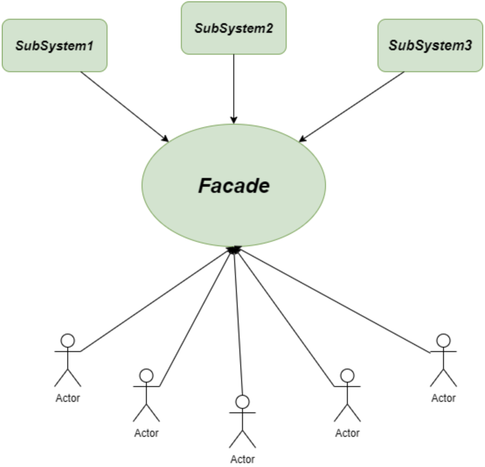

# 📅 2025/05/07
# Singleton 패턴에 대해서 설명해주세요
- 싱글톤 패턴은 객체 지향 프로그래밍에서 특정 클래스가 단 하나만의 인스턴스를 생성하여 사용하기 위한 패턴. 
- 생성자를 여러 번 호출하더라도 '인스턴스'가 **하나만** 존재하도록 보장하여 애플리케이션에서 동일한 객체 인스턴스에 접근할 수 있도록 하는 것.

<br>

## 싱글톤(Singleton) 패턴을 사용하는 이유
1. 메모리 측면 이점 
- 한 개의 인스턴스만을 고정 메모리 영역에 생성하고 추후 해당 객체를 접근할 때 메모리 낭비 방지 가능 
2. 속도 측면 이점
- 생성된 인스턴스를 사용할 때는 이미 생성된 인스턴스를 활용하여 속도 측면에 이점
3. 데이터 공유 쉬움
- 전역으로 사용하는 인스턴스이기 때문에 다른 클래스에서 데이터를 공유하며 사용할 수 있음.
- but, 동시성 문제 발생 가능하기 때문에 유의하여 설계해야 한다

<br>

## 싱글톤(Singleton) 패턴 구현 방법
- private 선언 (new 키워드 사용 불가능)
- getInstance() 메서드가 처음 실행 될 떄만 하나의 instance 생성되고 그 후에는 instance를 return
- 단 하나의 객체만을 생성, 사용

<br>

## 🔍 예제
### Java에서의 싱글톤 패턴 구현
```java
public class Singleton {
    // 단 1개만 존재해야 하는 객체의 인스턴스로 static 으로 선언
    private static Singleton instance;

    // private 생성자로 외부에서 객체 생성을 막아야 한다.
    private Singleton() {
    }

    // 외부에서는 getInstance() 로 instance 를 반환
    public static Singleton getInstance() {
        // instance 가 null 일 때만 생성
        if (instance == null) {
            instance = new Singleton();
        }
        return instance;
    }
}
```
=> 싱글톤 객체를 getInstance()를 통해 여러 변수에서 호출하더라도 같은 인스턴스를 참조

<br>

## 싱글톤(Singleton) 패턴 문제점
1. Multi-thread 환경에서 instance가 없을 때 동시에 getInstance() 서드를 실행하는 경우 각각 새로운 instance를 생성할 수 있음
- => 해결법 : sychronized 키워드 사용, double-checked locking 동기화 처리
2. 싱글톤은 전역 인스턴스를 사용하기 때문에 단위 테스트 시 상태 공유로 인해 테스트 간 간섭 발생
- => 해결법 : 테스트 시, mock이나 리플렉션으로 인스턴스 초기화하거나 싱글톤 사용 최소화

<br>


## ✨ 정리 포인트
싱글톤 패턴은 클래스의 인스턴스를 오직 하나만 생성하고, 어디서든 해당 인스턴스를 공유할 수 있도록 하는 디자인 패턴입니다. 주로 설정 클래스, 로깅, DB 커넥션 풀처럼 **하나만** 있어야 하는 자원에 사용됩니다.  
Java에서는 생성자를 **private**으로 선언하고, 정적 메서드인 **getInstance()**를 통해 인스턴스를 반환합니다.  
다만 멀티스레드 환경에서는 동시 접근 시 문제가 발생할 수 있어서, synchronized 키워드를 사용하거나 Double-Checked Locking 패턴으로 해결합니다.

---
# Bridge 패턴에 대해서 설명해주세요
- 객체의 구현부(implementation)와 추상층(abstraction)을 분리하여 각각 독립적으로 변형할 수 있게 하는 구조적인 디자인 패턴
- 서로 독립된 두 개의 계층이 서로 연결되어 동작하게 하는 것을 중점으로 한다

<br>

## 브릿지(Bridge) 패턴의 구조

- Abstraction: 기능의 추상적 정의, 구현체를 참조함
- RefinedAbstraction: Abstraction을 확장한 구체 클래스
- Implementor: 구현부의 인터페이스 정의
- ConcreteImplementor: 실제 구현 클래스

<br>

## 브릿지(Bridge) 패턴 장점
1. 추상화와 구현 간의 결합도를 줄인다
- 추상화와 구현이 분리되어 있어 둘 사이 의존성 감소, 그 결과 두 요소를 독립적으로 확장하거나 변경이 가능
2. 단일 책임 원칙 준수
- 추상화와 구현이 각각 다른 일을 처리하도록 분리함으로써, 각 클래스는 자신의 책임 영역에만 집중
3. 시스템 구조 개선
-  고수준의 추상화 코드와 저수준의 구현 코드를 분리함으로써, 깔끔하고 이해하기 쉬운 시스템 구조 가능 

<br>

## 브릿지(Bridge) 패턴 단점
1. 복잡성 증가
2. 추상화와 구현 간의 연결하는 코드를 작성해줘야 한다

<br>

## 🔍 예제
### Java에서의 브릿지 패턴 구현
```java
// Implementor
interface DrawAPI {
    void drawCircle(int radius, int x, int y);
}

// ConcreteImplementor
class RedCircle implements DrawAPI {
    public void drawCircle(int radius, int x, int y) {
        System.out.println("Red Circle at (" + x + "," + y + ") radius: " + radius);
    }
}

class GreenCircle implements DrawAPI {
    public void drawCircle(int radius, int x, int y) {
        System.out.println("Green Circle at (" + x + "," + y + ") radius: " + radius);
    }
}

// Abstraction
abstract class Shape {
    protected DrawAPI drawAPI;
    
    protected Shape(DrawAPI drawAPI){
        this.drawAPI = drawAPI;
    }
    public abstract void draw();
}

// RefinedAbstraction
class Circle extends Shape {
    private int x, y, radius;

    public Circle(int x, int y, int radius, DrawAPI drawAPI) {
        super(drawAPI);
        this.x = x;
        this.y = y;
        this.radius = radius;
    }

    public void draw() {
        drawAPI.drawCircle(radius, x, y);
    }
}

// 사용 예시
public class BridgePatternDemo {
    public static void main(String[] args) {
        Shape redCircle = new Circle(100,100, 10, new RedCircle());
        Shape greenCircle = new Circle(100,100, 10, new GreenCircle());

        redCircle.draw();
        greenCircle.draw();
    }
}
```
--- 

# Strategy 패턴에 대해서 설명해주세요
- 전략(Strategy) 패턴은 실행(런타임) 중에 알고리즘 전략을 선택하여 객체 동작을 실시간으로 바뀌도록 할 수 있게 하는 행위 디자인 패턴
- '전략'이란 알고리즘이 될 수도 있으며, 기능이나 동작이 될 수도 있는 특정한 목표를 수행하기 위한 행동 계획
- 객체의 행위를 변경하고 싶은 경우 **직접 수정하지 않고** 전략이라 불리는 **캡슐화한 알고리즘 객체**를 변경해줌으로써 유연하게 확장하는 방법

<br>

## 구성 요소
- Strategy (전략 인터페이스) : 공통된 알고리즘의 인터페이스 정의
- ConcreteStrategy (구체 전략) : 실제 알고리즘 또는 동작을 구현하는 클래스
- Context (문맥) : Strategy 객체를 사용하는 클래스. 실행 시 전략을 주입받음

<br>

## 장점
- 알고리즘을 정의하고 캡슐화하여 런타임 시에 알고리즘을 선택하는 데 사용됨
- 알고리즘을 쉽게 변경 및 대체할 수 있으므로 **유연함**
- 알고리즘 추가 및 수정을 할 때 코드 수정이 최소화되므로 **확장성**이 높아짐
- 알고리즘을 캡슐화했기에 코드 **재사용성**이 좋음
- 각각 알고리즘을 독립적으로 테스트할 수 있으므로 **용이**함

<br>

## 단점 
- 추가적인 클래스 및 인터페이스가 필요하기에 코드 복잡성이 증가될 수 있음
- 런타임 시에 알고리즘을 선택하는 데 추가적인 오버헤드 발생 가능
- 전략패턴을 구현하는 것이 어려울 수 있으므로, 적절한 분석과 설계가 필요함

<br>

## 🔍 예제
### Java에서의 전략 패턴 구현
```java
// 전략 인터페이스
public interface PaymentStrategy {
    void pay(int amount);
}

// 구체 전략 클래스들
public class CreditCardPayment implements PaymentStrategy {
    public void pay(int amount) {
        System.out.println(amount + "원을 신용카드로 결제합니다.");
    }
}

public class KakaoPayPayment implements PaymentStrategy {
    public void pay(int amount) {
        System.out.println(amount + "원을 카카오페이로 결제합니다.");
    }
}

// Context 클래스
public class PaymentService {
    private PaymentStrategy strategy;

    public PaymentService(PaymentStrategy strategy) {
        this.strategy = strategy;
    }

    public void processPayment(int amount) {
        strategy.pay(amount);
    }
}
```


# 📅 2025/05/22
# Builder 패턴에 대해서 설명해주세요
- 빌더 패턴은 디자인 패턴 중 하나로 **생성(Creational) 패턴** 중 하나 입니다.
- 빌더 패턴이란 복잡한 객체를 생성하는 방법 중 하나로, 객체의 생성 코드와 객체의 사용 코드를 분리하여 코드의 가독성과 유지 보수성을 향상시키는 패턴

- 복잡한 객체의 생성 과정을 단계별로 나누어 클라이언트가 이해하기 쉽도록 인터페이스를 제공하는 것이 빌더 패턴의 핵심입니다.
- 특히 복잡한 객체를 생성해야하는 상황에서 유용하며, DTO와 같은 복잡한 객체 생성에 사용하면 많은 이점을 제공합니다.

## 🔍 예제
### Java에서의 빌더 패턴 구현 방법
- 빌더 클래스를 선언하고, 생성할 객체의 속성에 대한 setter 메서드를 구현합니다.
- 이 메서드들은 빌더 객체 자신을 반환하므로 메서드 체이닝이 가능합니다. 또한 build 메서드를 통해 최종적인 객체를 생성합니다.

```java
public class User {
    private String name;
    private int age;
    
    public static class Builder {
        private String name;
        private int age;
        
        public Builder withName(String name) {
            this.name = name;
            return this;
        }
        
        public Builder withAge(int age) {
            this.age = age;
            return this;
        }
        
        public User build() {
            User user = new User();
            user.name = this.name;
            user.age = this.age;
            return user;
        }
    }
    
    public static void main(String[] args) {
        User user = new User.Builder()
                    .withName("Henry")
                    .withAge(30)
                    .build();
    }
}
```

- Lombok 라이브러리의 @Builder 어노테이션을 사용하여 빌더 패턴을 간단하게 구현할 수 있습니다.
```java
@Builder
@Getter
@Setter
public class User {
    private String name;
    private int age;
}

public static void main(String[] args) {
    User user = User.builder()
                    .name("Henry")
                    .age(30)
                    .build();
}
```

# Factory Method 패턴에 대해서 설명해주세요.
- 팩토리 메소드 패턴은 생성 패턴 중 하나로 객체를 생성할 때 어떤 클래스의 인스턴스를 만들 지 서브 클래스에서 결정하게 합니다.
- 즉, 인스턴스 생성을 서브 클래스에게 위임합니다.
- 부모 추상 클래스는 인터페이스에만 의존하고 실제로 어떤 구현 클래스를 호출할 지는 서브 클래스에서 구현합니다.

## 구조
    Creator (추상 클래스 / 인터페이스)
                   |
          ---------------------
          |                   |
ConcreteCreatorA       ConcreteCreatorB
          |                   |
       ProductA            ProductB


## 🔍 예제
### Java에서의 팩토리 메소드 패턴 구현 방법       
```java

// Product
interface Animal {
    void speak();
}

// ConcreteProduct
class Dog implements Animal {
    public void speak() {
        System.out.println("멍멍!");
    }
}

class Cat implements Animal {
    public void speak() {
        System.out.println("야옹~");
    }
}

// Creator
abstract class AnimalFactory {
    public abstract Animal createAnimal();
}

// ConcreteCreator
class DogFactory extends AnimalFactory {
    public Animal createAnimal() {
        return new Dog();
    }
}

class CatFactory extends AnimalFactory {
    public Animal createAnimal() {
        return new Cat();
    }
}

public class Main {
    public static void main(String[] args) {
        AnimalFactory factory = new DogFactory();  // 바꾸면 Cat도 가능
        Animal animal = factory.createAnimal();
        animal.speak();  // 출력: 멍멍!
    }
}
```

## 장단점
- 장점: Factory Method 패턴의 가장 큰 장점은 지금까지 본 것처럼 수정에 닫혀있고 확장에는 열려있는 OCP 원칙을 지킬 수 있음
- 단점: 간단한 기능을 사용할 때보다 많은 클래스를 정의해야 하기 때문에 코드량이 증가한다


# 퍼사드 패턴에 대한 예를 들어주세요.
- 퍼사드 패턴(Facade Pattern)은 구조 패턴(Structural Pattern)의 한 종류로써, 복잡한 서브 클래스들의 공통적인 기능을 정의하는 상위 수준의 인터페이스를 제공하는 패턴이다.

- 퍼사드 객체(Facade Object)는 서브 클래스의 코드에 의존하는 일을 감소시켜 주고, 복잡한 소프트웨어를 간단히 사용 할 수 있게 간단한 인터페이스를 제공해준다.

- 퍼사드 패턴을 통해 서브 시스템(SubSystem)들 간의 종속성을 줄여줄 수 있으며, 퍼사드 객체를 사용하는 곳(Client)에서는 여러 서브 클래스들을 호출할 필요 없이 편리하게 사용할 수 있다.


## Facade Pattern


- 여러 SubSystem들의 기능을 하나의 Facade Object로 정의하고, Client가 Facade Object를 사용하는 형태이다.


- 세탁를 하기 위해서는 크게 Washing, Rinsing, Spinning과 같은 동작들이 필요하다. 이들은 SubSystem들로써, Facade Object를 통해 '세탁'이라는 행위에 필요한 공통 기능들을 정의할 수 있다.


## 🔍 예제
### Java에서의 Facade 패턴 구현 방법  
```java
WashingMachine
class WashingMachine{

    Washing washing = new Washing();
    Rinsing rinsing = new Rinsing();
    Spinning spinning = new Spinning();

	void startWashing(){
    	washing.wash();
        rinsing.rinse();
        spinning.spin();
    }
}
Client
class Client{
    WashingMachine washingMachine = new WashingMachine();
    washingMachine.strartWahsing();
}
```
- Client에서는 Facade Object(WashingMachine)만을 호출하여 '세탁'이라는 동작을 수행할 수 있으며, 메서드의 의미 또한 명확하게 알 수 있다.

## 장단점
- 낮은 결합도 :
Client가 서브 시스템(SubSystem)들의 코드를 몰라도 된다. Facade Object만 알면 사용이 가능하다. 또한 서브 시스템들간의 복잡한 결합도 역시 낮출 수 있다.
- 가독성 상승
기존에는 Client에서 여러 서브 클래스들을 직접 호출해야 했다.
하지만 Facade Pattern을 사용하면 하나의 객체만을 호출하여 사용할 수 있고, 그 객체의 네이밍 역시 간단명료할 수밖에 없다.

- 서브 시스템 기능을 완전히 감추는 경우 유연성이 떨어질 수 있음
- 퍼사드 클래스가 비대해질 수 있음

--- 

# 📅 2025/06/06
# Spring에서 Bean의 기본 스코프가 싱글톤인 이유는 무엇인가요?
- 가장 큰 이유는 **성능 최적화와 자원 효율성을 극대화하기 위함**

1. 성능 최적화 및 메모리 효율성
- **객체 생성 비용 절감** : 애플리케이션 내에서 동일한 Bean을 여러 번 사용해야 할 경우, 매번 새로운 인스턴스를 생성하는 것은 CPU와 메모리 자원을 소모하는 작업입니다. 싱글톤 스코프를 사용하면 해당 Bean의 인스턴스를 애플리케이션 시작 시(또는 첫 요청 시) 한 번만 생성하여 메모리에 올려두고, 이후 모든 요청에서 동일한 인스턴스를 재사용합니다. 이는 객체 생성에 드는 오버헤드를 크게 줄여 애플리케이션의 응답 속도를 높이고 메모리 사용량을 절감합니다.
- **Garbage Collection 부하 감소**: 새로운 객체가 계속 생성되면 JVM의 가비지 컬렉터(Garbage Collector)가 더 자주, 더 많은 작업을 수행해야 합니다. 싱글톤 객체는 한 번만 생성되므로, 가비지 컬렉션의 대상이 되는 빈도가 줄어들어 시스템의 전반적인 성능을 향상시킵니다.

2. 일관된 상태 관리 (Stateless Bean에 적합)

- **대부분의 Spring Bean은 무상태(Stateless)로 설계됩니다.** 즉, 특정 사용자의 상태 정보를 저장하지 않고, 단순히 비즈니스 로직을 수행하는 서비스 객체나 데이터 접근 객체(DAO) 역할을 합니다.
- 무상태 Bean은 여러 스레드가 동시에 접근해도 안전하게 공유될 수 있으며, 싱글톤으로 관리되어도 아무런 문제가 없습니다. 오히려 동일한 로직을 수행하는 인스턴스가 여러 개 있을 필요가 없기 때문에 싱글톤이 이상적입니다.

3. 자원 공유 및 관리 용이성
- 데이터베이스 연결 풀(Connection Pool)이나 스레드 풀(Thread Pool)과 같이 애플리케이션 전역에서 공유되어야 하는 자원들은 싱글톤으로 관리하는 것이 효율적입니다. Spring의 싱글톤 Bean은 이러한 공유 자원들을 편리하게 관리하고 제공할 수 있도록 돕습니다.

4. Spring IoC 컨테이너의 역할 강화
- Spring의 핵심은 IoC(Inversion of Control) 컨테이너가 객체의 생명주기와 의존성을 관리하는 것입니다. 싱글톤은 컨테이너가 관리하는 객체의 기본 라이프사이클 모델이며, 이를 통해 컨테이너가 Bean들을 효율적으로 생성, 관리, 소멸시킬 수 있습니다.


# Repository 패턴의 목적과 장점을 설명하고, 프로젝트에서 JPA와 함께 어떻게 활용했는지 공유해주세요.

## **Repository 패턴이란?**
- Repository 패턴은 도메인 모델(비즈니스 로직을 담은 객체)과 데이터 영속성 계층(데이터베이스, 파일 시스템 등)을 분리하는 디자인 패턴입니다. 즉, 데이터 저장소에 대한 접근을 추상화하여 도메인 객체가 데이터를 어디서, 어떻게 가져오고 저장하는지 알 필요 없게 만듭니다.

- 쉽게 말해, 데이터베이스에서 데이터를 가져오거나 저장하는 '창구' 역할을 하는 객체를 만들고, 다른 계층(예: 서비스 계층)에서는 이 '창구'를 통해 데이터를 요청하는 방식입니다.

## Repository 패턴의 목적
1. 관심사의 분리(Separation of Concerns)

- 도메인 로직(비즈니스 규칙)과 데이터 접근 로직(SQL 쿼리, JPA 엔티티 관리 등)을 명확하게 분리합니다.
- 서비스 계층은 비즈니스 규칙에만 집중하고, Repository 계층은 데이터의 CRUD(Create, Read, Update, Delete) 작업에만 집중하게 됩니다.

2. 테스트 용이성(Testability)

- 데이터 접근 로직이 추상화되어 있으므로, 서비스 계층을 테스트할 때 실제 데이터베이스 연결 없이도 Repository 인터페이스의 Mock 객체(가짜 객체)를 사용하여 테스트할 수 있습니다. 이는 테스트 속도를 높이고 외부 의존성을 줄여줍니다.

3. 유지보수성 및 확장성(Maintainability & Extensibility)

- 데이터베이스 기술이 변경되거나, 데이터 저장 방식이 달라져도 Repository 인터페이스를 구현하는 클래스만 수정하면 됩니다. 서비스 계층이나 다른 상위 계층의 코드는 변경할 필요가 없어 유지보수가 용이합니다.
- 예를 들어, 관계형 데이터베이스에서 NoSQL 데이터베이스로 변경하더라도 Repository 인터페이스만 유지하면 됩니다.

## 프로젝트에서 JPA와 함께 Repository 패턴 활용 사례 공유
1. Repository 인터페이스 정의
- 먼저, 각 도메인 엔티티에 대한 Repository 인터페이스를 정의. 이 인터페이스는 `JpaRepository`를 상속받는다.
2. 서비스 계층에서의 Repository 활용
- 서비스 계층은 비즈니스 로직을 담당하며, Repository 인터페이스를 주입받아 데이터 접근 작업을 수행.
- 서비스 계층은 Repository가 데이터를 어떻게 가져오는지에 대한 구체적인 구현을 알지 못하고, 추상화된 메서드를 호출하여 필요한 데이터를 얻거나 저장한다. 


# 옵저버(Observer) 패턴을 언제 사용하는 것이 적절한지 설명하고, 실제 프로젝트에서 활용한 경험이 있다면 말씀해주세요.

## 옵저버(Observer) 패턴이란?
옵저버 패턴은 객체 간의 1대다(one-to-many) 의존성을 정의하는 디자인 패턴입니다. 어떤 객체의 상태가 변하면, 그 객체에 의존하는 모든 객체들(관찰자, Observer)에게 자동으로 알림이 가고 업데이트되도록 하는 방식입니다.

- **주제(Subject) / 발행자(Publisher)**: 상태 변화가 일어나는 객체. 옵저버들을 등록, 해지, 그리고 알림을 보내는 역할을 합니다.
- **옵저버(Observer) / 구독자(Subscriber)**: 주제의 상태 변화를 감지하고, 변화가 발생했을 때 어떤 동작을 수행하는 객체


## 옵저버 패턴 실제 프로젝트 경험(예시)
- 적용 전 문제점
    - 주문 상태 변경 시 너무 많은 코드 수정: "주문 접수" -> "결제 완료" -> "배송 중" 등으로 주문 상태가 바뀔 때마다, OrderService라는 핵심 서비스 코드 안에서 직접 이메일 발송, 배송 준비, 로그 기록 등 모든 후속 작업들을 호출해야 했습니다.
    - 강한 결합: OrderService가 너무 많은 다른 서비스들(알림 서비스, 배송 서비스 등)의 세부 사항을 알고 의존했습니다.
    - 유지보수 및 확장 어려움: 새로운 알림 방식이 추가되거나, 주문 상태 변경 시 다른 기능이 필요할 때마다 OrderService를 계속 고쳐야 했습니다.

**옵저버 패턴 적용 (Spring Application Event 활용)**
Spring 프레임워크의 Application Event 기능을 사용하여 옵저버 패턴을 구현했습니다.

1. 이벤트 발생 (Subject):

- OrderService는 주문 상태를 변경한 후, 직접 후속 작업을 호출하는 대신 **OrderStatusChangedEvent라는 이벤트를 "발행"**했습니다.
- OrderService는 이제 어떤 작업들이 이 이벤트에 반응하는지 전혀 알 필요가 없습니다.

2. 이벤트 수신 (Observer):

- 이메일 발송 서비스, 배송 준비 서비스, 로그 서비스 등 각 후속 작업을 담당하는 별도의 서비스들이 @EventListener 어노테이션을 사용하여 OrderStatusChangedEvent를 "구독"했습니다.
이 서비스들은 이벤트가 발행될 때마다 자동으로 자신의 역할을 수행합니다.

- 옵저버 패턴을 통해 주문 상태 변경이라는 단일한 사건에 대해 여러 시스템이 독립적으로 반응할 수 있는 유연하고 확장 가능한 아키텍처를 구축할 수 있었습니다.