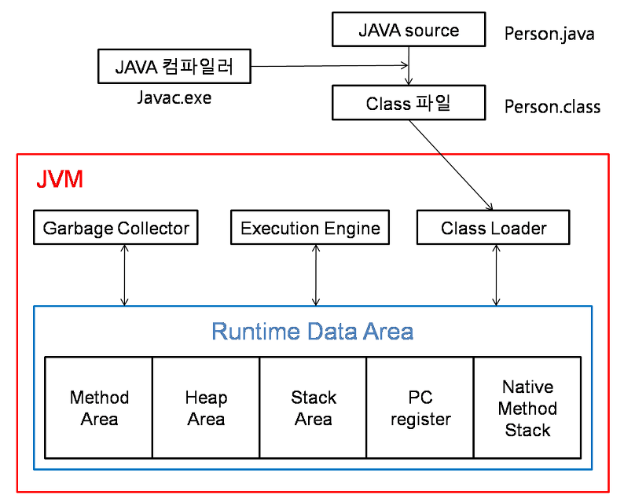

# 📅 2025/05/08
# JVM의 구조와 Java의 실행방식을 설명해주세요.

 

## JVM이란?
- Java 가상머신으로 **Java 바이트 코드**를 실행할 수 있는 주체 

 

## JVM의 구조
- Class Loader
- Execution Engine
- Garbage Collector
- Runtime Data Area

 

## Java의 실행방식
1. 자바 애플리케이션의 실행에서 **Java 컴파일러**가 먼저 동작을 수행한다
2. Java 컴파일러는 .java 파일을 모두 JVM이 사용할 수 있는 **.class 파일로 컴파일** 한다. 이 시점이 **컴파일 타임**이다.
3. 이후 JVM을 실행하면서 **런타임 시점**이 시작된다.
4. JVM 내부에서는 애플리케이션을 실행하기 위해 Execution Engine이 필요한 클래스들을 Class Loader에 요청하고 Class Loader가 바이트코드의 .class에서 가져와 메모리에 올린다. 
5. 가져오는 클래스들의 바이트 코드들이 이상이 없는 지, 자바의 보안 규칙을 위배하지 않는 지 검사
6. 그 다음으로 Execution Engine이 메모리에 올라온 바이트코드를 실행하면서 애플리케이션이 실행된다. 계속 이러한 동작을 하면서 애플리케이션이 동작한다.

 

### ✨ 정리 포인트
- JVM은 Java 바이트코드를 실행하는 가상 머신이며, 주요 구성은 Class Loader, Runtime Data Area, Execution Engine, Garbage Collector입니다. Java의 실행 흐름은 .java 소스를 컴파일러가 .class로 변환하고, 이후 JVM이 클래스를 로드하여 메모리에 올린 뒤 Execution Engine이 이를 실행. JVM의 구조 덕분에 Java는 플랫폼 독립적인 언어가 된다.

--- 
# GC(Garbage Collection)가 무엇인지, 필요한 이유는 무엇인지, 동작방식에 대해 설명해주세요.

## GC(Garbage Collection)란
- 자바 가상 머신(JVM) 내에서 사용되는 메모리 관리 기술 중 하나. 이는 프로그램이 동적으로 할당한 메모리 중에서 **더 이상 사용되지 않는 객체들을 찾아 해제하여 메모리 누수를 방지**하고 프로그램의 성능을 최적화 한다.

 

## GC(Garbage Collection)의 필요성
- 메모리 누수 방지 : 프로그램에서 더 이상 필요하지 않은 객체들이 메모리에 계속 쌓이면, 시스템의 메모리가 부족해지고 성능이 저하될 수 있다 
- 편의성 : 개발자가 메모리 할당 및 해제에 대한 번거로움을 줄여준다. 명시적인 메모리 관리가 필요하지 않으므로 코드 작성이 간편해진다
- 안정성 : GC는 메모리 관리를 자동화하여 메모리 오류로부터 프로그램을 보호
- 객체 추적 : GC는 사용 중인 객체와 사용되지 않는 객체를 구별하기 위해 객체를 추적한다. 이를 위해 root 객체부터 시작하여 참조 체인을 따라가며 도달 가능한 객체를 식별한다
- 메모리 해제 : 가비지 식별이 완료되면 GC는 해당 객체들의 메모리르 해제하여 재사용 할 수 있도록 한다. 이 과정은 자원을 회수하여 다른 용도로 재사용할 수 있도록 한다

 

## GC(Garbage Collection)의 동작방식
1. Stop The World : JVM이 GC를 실행하기 위해 애플리케이션의 실행을 멈추는 작업. GC를 실행하는 쓰레드 외 다른 모든 쓰레드는 작업이 중단
2. Mark And Sweep : Stop The World 이후, GC가 사용되지 않는 메모리를 식별하는 과정을 Mark, 이 메모리를 제거하는 과정을 Sweep이라 한다

 

--- 

# 객체지향에 대해서 설명해주세요.

## 객체지향 (Object-Oriented Programming, OOP)이란
- **사물(객체)를 소프트웨어로 모델링하여 프로그래밍 하는 방식** 데이터(속성)와 기능(행위)을 하나의 단위(클래스, 객체)로 묶어서 설계하고 개발

 

## 객체지향의 장단점
1. 장점 
- 코드 재사용 용이
- 유지보수 용이
- 확장성 용이
- 가독성 용이

 

2. 단점
- 초기 설계가 복잡
- 프로그래밍 난이도 상승
- 속도 측면에서는 절차지향보다 느릴 수 있음 (상대적으로)

 

## 객체지향 5대 원칙
1. SRP(Single Responsibility Principle, 단일 책임 원칙) : 객체는 오직 하나의 책임을 가져야 한다
2. OCP(Open-Closed Principle, 계방-폐쇠 원칙) : 객체는 확장에 대해서는 개방적이고 수정에 대해서는 폐쇄적이어야 한다
3. LSP(Liskov Substitution Principle, 리스코프 치환 원칙) : 자식 클래스는 언제나 자신의 부모 클래스를 대체할 수 있습니다. 즉, 부모 클래스가 들어갈 자리에 자식 클래스를 넣어도 계획대로 잘 작동해야 한다.
4. ISP(Interface Segregation Principle, 인터페이스 분리 원칙) : 클라이언트에서 사용하지 않는 메서드는 사용해선 안된다는(의존 관계를 맺어서는 안된다) 원칙입니다. (인터페이스의 SRP)
5. DIP(Dependency Inversion Principle, 의존성 역전 원칙) : 추상적인 것은 자신보다 구체적인 것에 의존하지 않고, 변화하기 쉬운 것에 의존해서는 안된다. 즉, 자신이 변하기 쉬운 것에 의존하지 말라는 것.

--- 