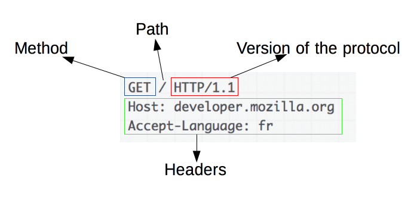
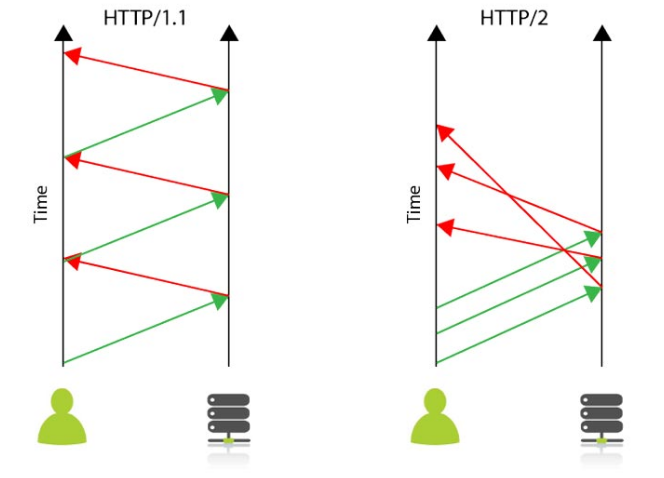

# 📅 2025/05/12
# HTTP와 HTTPS의 차이점에 대해 설명해주세요

## HTTP란
- HTTP(Hyper Text Transfer Protocol)란 **서버/클라이언트 모델을 따라 데이터를 주고 받기 위한 프로토콜**이다.
즉, HTTP는 인터넷에서 하이퍼텍스트를 교환하기 위한 통신 규약으로, 80번 포트를 사용하고 있다. 따라서 HTTP 서버가 80번 포트에서 요청을 기다리고 있으며, 클라이언트는 80번 포트로 요청을 보내게 된다.

 

## HTTP의 구조

- HTTP는 애플리케이션 레벨의 프로토콜로 TCP/IP 위에서 작동한다. HTTP는 상태를 가지고 있지 않는 Statless 프로토콜이며, Method, Path, Version, Headers, Body등으로 구성된다.
- ex) 상태 유지가 필요한 경우 쿠키, 세션, 토큰 활용

 

## HTTPS란
- HTTPS(Hyper Text Transfer Protocol Secure)는 **HTTP에 데이터 암호화가 추가된 프로토콜**이다. HTTPS는 HTTP와 다르게 443번 포트를 사용하며, 네트워크 상에서 중간에 제3자가 정보를 볼 수 없도록 암호화를 지원한다.
- HTTPS는 대칭키 암호화 방식과 비대칭키 암호화 방식을 모두 사용한다

 

### ✨ 정리 포인트
- HTTP는 클라이언트와 서버가 데이터를 주고받기 위한 **비연결성(stateless)**의 애플리케이션 계층 프로토콜입니다.
주로 웹에서 HTML, JSON 같은 데이터를 주고받으며, 80번 포트를 사용합니다. 상태를 저장하지 않기 때문에, 인증이 필요한 경우에는 쿠키, 세션, 토큰 등을 별도로 사용
- HTTPS는 HTTP에 보안이 추가된 프로토콜로, SSL/TLS를 통해 데이터를 암호화해서 통신합니다. 443번 포트를 사용하며, 주로 대칭키와 비대칭키를 함께 사용해 보안성과 성능을 모두 확보합니다. 브라우저는 CA에서 발급한 인증서를 통해 서버의 신뢰성을 검증

---

# HTTP/1.1과 HTTP/2의 차이점에 대해 설명해주세요.

## HTTP/1.1
- 현재까지 가장 널리 사용되는 HTTP 프로토콜
- 요청/응답 모델을 사용(클라이언트가 서버에 요청, 서버가 클라이언트에 응답)
- 기본적으로 Connection당 하나의 요청을 처리하도록 설계
- 동시 전송 불가능하고 요청과 응답이 순차적 
- HTTP 문서 안에 포함된 다수의 리소스(Image, CSS, Script)를 처리하려면 요청할 리소스 개수에 비례해서 Latency(대기 시간) 길어짐

 

## HTTP2
- HTTP1.1의 단점을 보완하고 성능을 개선하기 위해 개발된 프로토콜
- 바이너리 프로토콜(Binary Protocol) 사용 : 바이너리 프레이밍 계층으로 성능 최적화
- 멀티플렉싱(Multiplexing) : 한 커넥션으로 동시에 여러 개의 메세지를 주고 받을 수 있으며, 응답은 순서에 상관없이 stream으로 주고 받음
- Servcer Push : 서버는 클라이언트의 요청에 대해 요청하지도 않은 리소스를 보내줄 수 있음
- Header Compression : Header 정보를 압축하기 위해 Header Table과 Huffman Encoding 기법을 사용하여 처리하는데 이를 HPACK 압축방식이라 부르며 별도의 명세서(RFC 7531)로 관리

 

### ✨ 정리 포인트
HTTP/1.1은 하나의 커넥션에서 요청을 순차적으로 처리해 **지연(latency)**이 큽니다.
반면, HTTP/2는 하나의 커넥션에서 여러 요청을 **동시에 처리(Multiplexing)**할 수 있어 성능이 훨씬 개선

---

# REST API란 무엇이며, RESTful한 API를 설계하는 원칙에 대해 설명해주세요

## REST API
- REST (REpresentational State Transfer)는 웹 서비스가 어떻게 동작해야 하는지에 대한 아키텍처 스타일 또는 설계 원칙
- REST는 클라이언트와 서버 간의 상호작용을 규정하며, 여러 가지 원칙과 제약 조건들을 가지고 있음
- 웹상의 자원을 이름으로 구분하고 해당 자원의 상태를 주고 받는 모든 것을 의미. HTTP 프로토콜을 그대로 활용하는 아키텍처
- HTTP 메소드 활용(GET,POST,PUT,PATCH,DELETE)
- HTTP 응답 상태 코드 활용

 

## RESTful API
- REST 아키텍처 스타일을 따르는 웹 API. 즉 REST 원칙을 잘 지키며 설계된 API를 RESTful API라 한다

 

### ✨ 정리 포인트
- REST는 이론적인 원칙과 가이드(클라이언트-서버 구조)
- RESTful API는 그 원칙과 가이드라인을 실제로 적용한 API를 의미

---

# 📅 2025/05/27
# HTTP 상태 코드에 대해 설명해주세요.
- 1XX: Informational(정보 제공)
    - 임시 응답으로 현재 클라이언트의 요청까지는 처리되었으니 계속 진행하라는 의미입니다. HTTP 1.1 버전부터 추가되었습니다.
- 2XX: Success(성공)
    - 클라이언트의 요청이 서버에서 성공적으로 처리되었다는 의미입니다.
- 3XX: Redirection(리다이렉션)
    - 완전한 처리를 위해서 추가 동작이 필요한 경우입니다. 주로 서버의 주소 또는 요청한 URI의 웹 문서가 이동되었으니 그 주소로 다시 시도하라는 의미입니다.
- 4XX: Client Error(클라이언트 에러)
    - 없는 페이지를 요청하는 등 클라이언트의 요청 메시지 내용이 잘못된 경우를 의미합니다.
- 5XX: Server Error(서버 에러)
    - 서버 사정으로 메시지 처리에 문제가 발생한 경우입니다. 서버의 부하, DB 처리 과정 오류, 서버에서 익셉션이 발생하는 경우를 의미합니다.
 
 # TCP와 UDP의 차이점에 대해 설명해주세요.

 # TCP란?
 - TCP란 Transmission Control Protocol의 약자로 **전송을 제어하는 규약**
 - 인터넷 상에서 데이터를 메세지 형태로 보내기 위해 IP와 함께 사용하는 규약
 - TCP는 `패킷을 추적 및 관리`하고 IP는 `데이터의 배달을 처리`한다. 
    (패킷: 인터넷 내에서 데이터 전송을 위한 라우팅을 효율적으로 하기 위해 나누어진 조각들을 뜻함함)

 ## TCP 특징
 - 연결형(connection-oriented) 서비스로 연결이 성공해야 통신이 가능
 - 데이터의 경계를 구분하지 않는다. (byte stream service)
 - 데이터의 전송 순서를 보장한다. 데이터의 순서유지를 위해 각 바이트마다 번호가 부여됨
 - 신뢰성 있는 데이터를 전송한다 (Sequence Number, Ack Number)
    - Sequence Number : `TCP 세그먼트의 연속된 데이터 번호`
    - Ack Number : 상대방으로부터 받아야하는 `다음 TCP 세그먼트 데이터 번호`
- 데이터 흐름 제어(수신자 버퍼 오버플로우 방지) 및 혼잡 제어(패킷 수가 과도하게 증가하는 것 방지)
- 연결의 설정(3-way handshaking), 해제(4-way handshaking)

## TCP 단점
- 데이터로 보내기 전에 반드시 연결이 되어야 함
- 1:1 통신만 가능
- 고정된 통신 선로가 최단선이 아닐 경우 상대적으로 UDP보다 데이터 전송 속도가 느리다

# UDP란?
- UDP(User Datagram Protocol)는 전송계층의 **비연결 지향적 프로토콜**을 뜻한다
- 비연결 지향적이란, 데이터를 주고 받을 때 연결 절차를 거치지 않고 발신자가 일방적으로 데이터를 발신하는 방식을 의미
- 연결 과정이 없기 때문에 TCP 보다 빠른 전송이 가능하지만, 데이터가 유실 될 수 있고, 데이터 패킷을 순차적으로 보내더라도 먼저 보낸 패킷이 느린 선로를 통해 전송될 경우 나중에 보낸 패킷보다 늦게 수신될 수 있다.

## UDP 특징
- 비연결형 서비스로 연결 없이 통신이 가능하며 데이터그램 방식(주로 OSI 7계층 중 네트워크 계층에서 사용)을 제공한다
- 데이터 경계를 구분한다 (데이터그램 서비스)
- 정보를 주고 받을 때 정보를 보내거나 받는다는 신호 절차를 거치지 않는다
- 신뢰성 없는 데이터를 전송한다
- 패킷관리가 필요하다
- 패킷 오버헤드가 적어 네트워크 부하가 감소되는 장점
- 상대적으로 TCP보다 전송속도가 빠르다

## UDP 단점
- 데이터의 신뢰성이 없다
- 의미있는 서버를 구축하기 위해서는 일일이 패킷을 관리해주어야 한다.

# 쿠키와 세션의 차이점에 대해 설명해주세요.
- 쿠키와 세션은 HTTP 프로토콜의 특징이자 약점을 보완하기 위해 사용한다.
- HTTP 프로토콜은 `비연결지향`과 `상태정보 유지 안함`이라는 특징을 가지고 있다.
- 따라서, 서버와 클라이언트가 통신을 할 때 통신이 연속적으로 이어지지 않고 한 번 통신이 되면 끊어진다.

# 쿠키(Cookie)
- HTTP의 일종으로 사용자가 어떤 웹 사이트를 방문할 경우, 해당 사이트가 사용하고 있는 서버에서 **사용자의 컴퓨터에 저장하는 작은 기록 정보 파일**
- HTTP 클라이언트의 상태정보를 쿠키 형태로 클라이언트 PC에 저장하였다가 **필요 시 정보를 참조하거나 재사용할 수 있다**

## 쿠키의 특징
- Key-Value 쌍으루 구성되어 있는 데이터 파일
- 쿠키 이름, 쿠키값, 만료시간, 전송할 도메인명, 전송할 경로, 보안연결여부, HttpOnly여부로 구성
- 도메인 당 20개의 쿠키를 가질 수 있다
- 하나의 쿠키는 4KB(=4096 byte)까지 저장 가능

## 쿠키의 사용목적
1. 세션 관리(Session Management)
    - 로그인, 사용자 닉네임, 접속 시간, 장바구니 등의 서버가 알아야할 정보를 저장
2. 개인화(Personalization)
    - 사용자마다 다르게 그 사람이 적절한 페이지를 보여줄 수 있다
3. 트래킹(Tracking)
    - 사용자의 행동과 패턴을 분석하고 기록

## 쿠키의 단점 
- 쿠키는 클라이언트에서 수정할 수 있기 때문에 위변조의 위험이 항상 존재한다. 
- 따라서 쿠키값(value)를 암호화해야 하며, 민감하거나 중요한 정보를 담지 않도록 해야한다.

# 세션(Session)
- 일정 시간 동안 같은 사용자(브라우저)로부터 들어오는 일련의 요구를 하나의 상태로 보고, 그 상태를 유지시키는 기술
- 여기서 일정 시간은 방문자가 웹 브라우저를 통해 웹 서버에 접속한 시점부터 웹 브라우저를 종료하여 연결을 끝내는 시점을 말한다.
- 즉, 브라우저가 종료되기 전까지 클라이언트의 요청을 유지하게 해주는 기술을 세션이라고 한다.

## 세션의 특징
- 웹 서버에 웹 컨테이너의 상태를 유지하기 위한 정보를 저장한다.
- 웹 서버에 저장되는 쿠키(세션 쿠키 / session cookie)이다.
- 브라우저를 닫거나, 서버에서 세션을 삭제했을 때만 삭제가 되기 때문에 쿠키보다 비교적 보안적으로 우수하다.
- 저장 데이터에 제한이 없다.(서버 용량 허용 범위 내에서)
- 각 클라이언트에 고유 세션 ID(Session ID)를 부여한다. 세션 ID를 통해 클라이언트를 구분하여 각 요구에 맞는 서비스를 제공한다.

## 세션의 사용목적
- 사용자나 다른 누군가에게 노출되면 안된느 보안적으로 중요한 정보들을 서버 안에서 다루기 위해 사용

## 세션의 단점
- 세션의 내용은 서버에 저장되기 때문에 계속하여 늘어날 경우 서버 부하 발생
- 또한, 세션에 대한 정보가 서버에 있어 쿠키에 비해 비교적 속도가 느림

# 쿠키 vs 세션

| 항목        | Cookie                          | Session                           |
|-------------|----------------------------------|-----------------------------------|
| 저장 위치   | Client                          | Server                            |
| 저장 형식   | Text                            | Object                            |
| 만료 시점   | 쿠키 저장 시 설정 (설정 없으면 브라우저 종료 시) | 정확한 시점 모름              |
| 리소스      | 클라이언트의 리소스              | 서버의 리소스                     |
| 용량 제한   | 한 도메인 당 20개, 한 쿠키 당 4KB | 제한 없음                         |
| 속도        | 쿠키에 정보가 있어 비교적 빠름    | 정보가 서버에 있어 비교적 느림   |

# 📅 2025/06/11
# 웹소켓(WebSocket)과 HTTP의 차이점에 대해 설명해주세요.
- 웹에서 클라이언트(브라우저)와 서버가 통신하는 방식에는 여러 가지가 있지만, 가장 기본적인 것은 **HTTP(HyperText Transfer Protocol)**이고, 실시간 통신을 위해 등장한 것이 **웹소켓(WebSocket)**입니다. 둘 다 웹 통신을 위한 프로토콜이지만, 설계 목적과 동작 방식에서 근본적인 차이를 가집니다.

## HTTP(HyperText Transfer Protocol)
1. 단방향 통신(요청-응답 모델)
- 클라이언트가 서버에게 **요청(Request)**를 보내면 서버는 그 요청에 대한 **응답(Response)**을 보내는 방식으로 작동
2. 무상태(Stateless)
- 각 요청과 응답은 완전히 독립적. 서버는 이전 요청에 대한 어떤 정보도 유지하지 않는다.
3. 연결의 비영속성(Connectionless)
- 기본적으로 요청-응답 한 번에 TCP 연결을 맺고 데이터를 주고받은 후 연결을 끊는다.
4. 헤더 오버헤드
- 각 요청/응답마다 헤더(Header) 정보를 포함하므로, 작은 데이터를 자주 주고받을 경우 이 헤더의 크기가 실제 데이터보다 커져 네트워크 오버헤드가 발생할 수 있다

## 웹소켓(WebSocket)
- HTTP의 한계를 극복하고 **실시간 양방향 통신**을 위해 등장한 프로토콜

1. 양방향 통신(Full-Duplex)
- 클라이언트와 서버가 한 번 연결을 수립하면, 서로 독립적으로 언제든지 데이터를 주고받을 수 있다
- 서버도 클라이언트의 요청 없이 먼저 데이터를 보낼 수 있다
2. 영속적인 연결(Persistent Connection)
- 최초 연결 수립 시 HTTP 핸드세이크(Handshake) 과정을 통해 웹소켓 연결로 업그레이드한다
- 이후에는 하나의 TCP 연결을 계속 유지하며 데이터를 주고받는다. 연결을 한 번만 수립하므로 연결/해제 오버헤드가 없다.
3. 상태 유지(Stateful)
- 한 번 연결이 수립되면 해당 연결은 상태를 유지하며, 연결이 끊어질 때까지 지속된다
4. 낮은 오버헤드
- 최초 핸드셰이크 이후에는 데이터 프레임에만 최소한의 헤더가 붙어 전송되므로, HTTP에 비해 네트워크 오버헤드가 훨씬 적다. 작은 데이터를 자주 주고받을 때 매우 효율적

# OSI 7계층에 대해 설명해주세요.
- OSI 7계층(Open Systems Interconnection 7-Layer Model)은 국제 표준화 기구(ISO)에서 네트워크 통신 과정을 7개의 독립적인 계층으로 나눈 개념적인 모델입니다. 
- 이 모델은 다양한 컴퓨터 시스템들이 서로 통신할 수 있도록 네트워크 통신을 표준화하고 이해하기 쉽게 만들었습니다.

## OSI 7계층의 이점
- 모듈화: 각 계층이 독립적이므로, 한 계층의 변경이 다른 계층에 영향을 주지 않아 유지보수가 용이합니다.
- 표준화: 서로 다른 벤더의 장비나 소프트웨어 간에도 호환성을 보장하여 네트워크 통신이 가능하게 합니다.
- 문제 해결 용이: 통신에 문제가 발생했을 때, 문제가 발생한 계층을 특정하여 빠르게 해결할 수 있습니다.
- 학습 용이성: 복잡한 네트워크 통신 과정을 단계별로 이해하고 학습하기 용이합니다.

## OSI 7계층 역할
7. 응용 계층 (Application Layer)
- 역할: 사용자(애플리케이션)가 네트워크 서비스에 접근할 수 있도록 인터페이스를 제공합니다. 사용자와 직접 상호작용하는 유일한 계층입니다.
- 주요 기능: 데이터 생성, 웹 브라우징, 이메일 전송, 파일 전송 등 특정 응용 프로그램의 서비스 제공.
- 데이터 단위: 데이터 (Data)
- 프로토콜: HTTP, FTP, SMTP, POP3, DNS 등
장비: 사용자 PC의 응용 프로그램 (웹 브라우저, 이메일 클라이언트 등)

6. 표현 계층 (Presentation Layer)
- 역할: 응용 계층의 데이터를 다양한 애플리케이션이나 시스템이 이해할 수 있는 공통된 형식으로 변환합니다. 데이터의 암호화/복호화, 압축/압축 해제, 인코딩/디코딩 등을 수행합니다.
- 주요 기능: 데이터 형식 변환 (JPEG, MPEG 등), 암호화/복호화, 압축/압축 해제.
- 데이터 단위: 데이터 (Data)
- 프로토콜: JPEG, MPEG, ASCII, EBCDIC 등

5. 세션 계층 (Session Layer)
- 역할: 통신하는 두 애플리케이션 간의 대화(세션)를 설정, 유지, 동기화하고 종료하는 역할을 합니다. 통신 중 연결이 끊어졌을 경우 복구 기능을 제공하기도 합니다.
- 주요 기능: 세션 설정/해제, 대화 제어(반이중, 전이중), 동기화 지점 설정.
- 데이터 단위: 데이터 (Data)
- 프로토콜: NetBIOS, RPC, PTP 등

4. 전송 계층 (Transport Layer)
- 역할: 송신자와 수신자 간의 신뢰성 있고 효율적인 데이터 전송을 보장합니다. 데이터를 세그먼트 단위로 분할하고 재조립하며, 오류 제어, 흐름 제어, 중복 검사 등을 수행합니다. 포트 번호를 사용하여 어떤 애플리케이션 프로세스로 데이터를 전달할지 결정합니다.
- 주요 기능: 종단 간(End-to-End) 통신 보장, 오류 복구 및 흐름 제어, 세그먼트화 및 재조립.
- 데이터 단위: 세그먼트 (Segment - TCP), 데이터그램 (Datagram - UDP)
- 프로토콜: TCP, UDP
- 장비: 게이트웨이

3. 네트워크 계층 (Network Layer)
- 역할: 여러 개의 네트워크를 통해 **패킷을 목적지까지 가장 효율적인 경로로 전달(라우팅)**합니다. IP 주소를 사용하여 논리적인 주소 지정을 수행합니다.
- 주요 기능: 라우팅(경로 설정), 논리적 주소 지정(IP 주소), 패킷 전달.
- 데이터 단위: 패킷 (Packet)
- 프로토콜: IP, ICMP, ARP 등
- 장비: 라우터, L3 스위치

2. 데이터 링크 계층 (Data Link Layer)
- 역할: 물리적인 연결을 통해 인접한 두 장치(Node-to-Node) 간의 신뢰성 있는 데이터 전송을 담당합니다. 물리 계층에서 발생할 수 있는 오류를 감지하고 수정하며, 흐름 제어, 매체 접근 제어(MAC) 등을 수행합니다.
- 주요 기능: 프레임 구성, 물리적 주소(MAC 주소) 지정, 오류 감지 및 재전송, 흐름 제어.
- 데이터 단위: 프레임 (Frame)
- 프로토콜: Ethernet, PPP, MAC
- 장비: 브리지, 스위치 (L2 스위치), 네트워크 카드(NIC)

1. 물리 계층 (Physical Layer)
- 역할: 데이터를 전기적, 광학적, 무선 신호와 같은 물리적인 형태로 변환하여 전송 매체(케이블, 무선 등)를 통해 비트 스트림(0과 1)을 전송하고 수신합니다. 단순히 데이터를 전달하는 역할만 하며, 오류 제어나 논리적 주소 지정 기능은 없습니다.
- 주요 기능: 비트 전송, 물리적 연결 설정/유지/해제, 신호 변환.
- 데이터 단위: 비트 (Bit)
- 프로토콜: RS-232, 10BASE-T 등
- 장비: 허브, 리피터, 케이블, 네트워크 카드

## 암호학/보안
# CORS(Cross-Origin Resource Sharing)란 무엇이며, 어떻게 해결할 수 있는지 설명해주세요.
- **CORS(Cross-Origin Resource Sharing, 교차 출처 리소스 공유)**는 웹 브라우저가 특정 웹 페이지에서 로드된 스크립트가 다른 도메인(출처), 프로토콜 또는 포트의 리소스에 접근할 수 있도록 허용하는 메커니즘입니다. 쉽게 말해, **서로 다른 출처 간의 HTTP 요청을 가능하게 하는 보안 기능**

## CORS 해결 방법
1. 서버 측에서 HTTP 응답 헤더 추가
- `Access-Control-Allow-Origin`: 필수 헤더로, 리소스에 접근을 허용할 출처를 명시합니다
- `Access-Control-Allow-Methods`: 리소스에 접근을 허용할 HTTP 메서드(GET, POST, PUT, DELETE 등)를 명시합니다.
- `Access-Control-Allow-Headers`: 리소스에 접근을 허용할 요청 헤더를 명시합니다. (예: `Authorization`, `Content-Type`)
- `Access-Control-Allow-Credential`s: 자격 증명(쿠키, HTTP 인증, SSL 클라이언트 인증서)을 포함한 요청을 허용할지 여부를 명시합니다. 이 헤더를 true로 설정하면 `Access-Control-Allow-Origin`에 `*`를 사용할 수 없습니다.
- `Access-Control-Expose-Headers`: 클라이언트가 접근할 수 있는 응답 헤더를 명시합니다.
- `Access-Control-Max-Age`: 프리플라이트(Preflight) 요청의 결과를 캐시할 시간을 초 단위로 명시합니다.

2. 프록시 서버 사용
- 프록시 서버는 클라이언트의 요청을 대신 백엔드 서버로 전달하고, 백엔드 서버의 응답을 받아 다시 클라이언트에게 전달해주는 중간 서버입니다.
- 클라이언트(브라우저)는 프록시 서버와 동일한 출처에 있으므로 SOP에 위배되지 않습니다. 프록시 서버는 백엔드 서버로 요청을 보내는데, 서버-서버 통신은 브라우저의 CORS 제약을 받지 않습니다.

# 📅 2025/06/26
# SQL Injection에 대해서 간단히 설명해주세요.
- SQL Injection은 공격자가 애플리케이션의 입력값에 악의적인 SQL 문을 삽입해서, 의도하지 않은 데이터베이스 쿼리를 실행하게 만드는 보안 취약점

# XSS에 대한 설명과 방어 방법을 알려주세요.
- **XSS(Cross-Site Scripting)는 공격자가 악의적인 스크립트를 삽입하여, 사용자의 브라우저에서 실행되도록 하는 공격**
- 이를 방지하기 위해 사용자 입력을 화면에 출력할 때 HTML escape 처리(th:text 등)를 기본으로 하고, 필요한 경우 정규식 필터링과 CSP 적용도 함께 고려해야 합니다.
- 프론트에서는 innerHTML 대신 textContent를 사용하고, API 응답 시에도 XSS 필터링 유틸을 적용하는 식으로 방어합니다.

# CSRF에 대한 설명과 방어 방법을 알려주세요.
- **CSRF(Cross-Site Request Forgery)는 공격자가 사용자의 인증 정보를 악용해, 사용자의 의도와 다른 요청을 서버에 보내는 공격**.
- 이를 방지하기 위해 CSRF 토큰을 활용해 서버가 요청의 유효성을 검증하고, 쿠키에는 `SameSite` 속성을 설정하여 외부 도메인에서의 쿠키 전송을 제한합니다.
- Spring Security에서는 기본적으로 CSRF 보호가 활성화되어 있기 때문에, 폼 기반 요청에는 _csrf 토큰을 함께 보내도록 하고, - REST API에서는 헤더에 CSRF 토큰을 포함시켜 검증합니다.