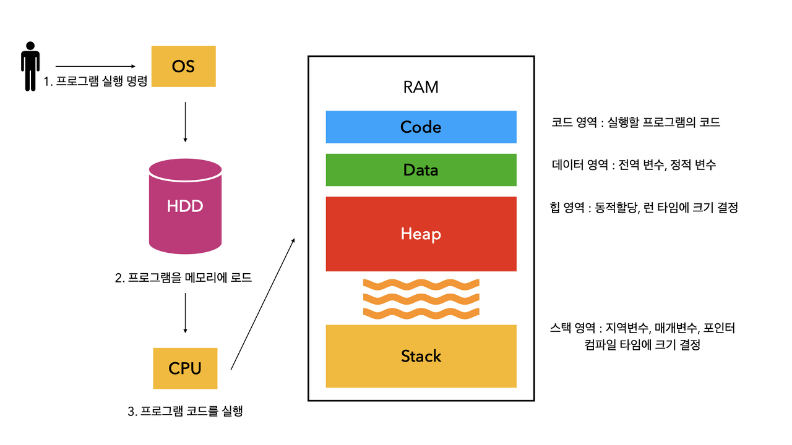
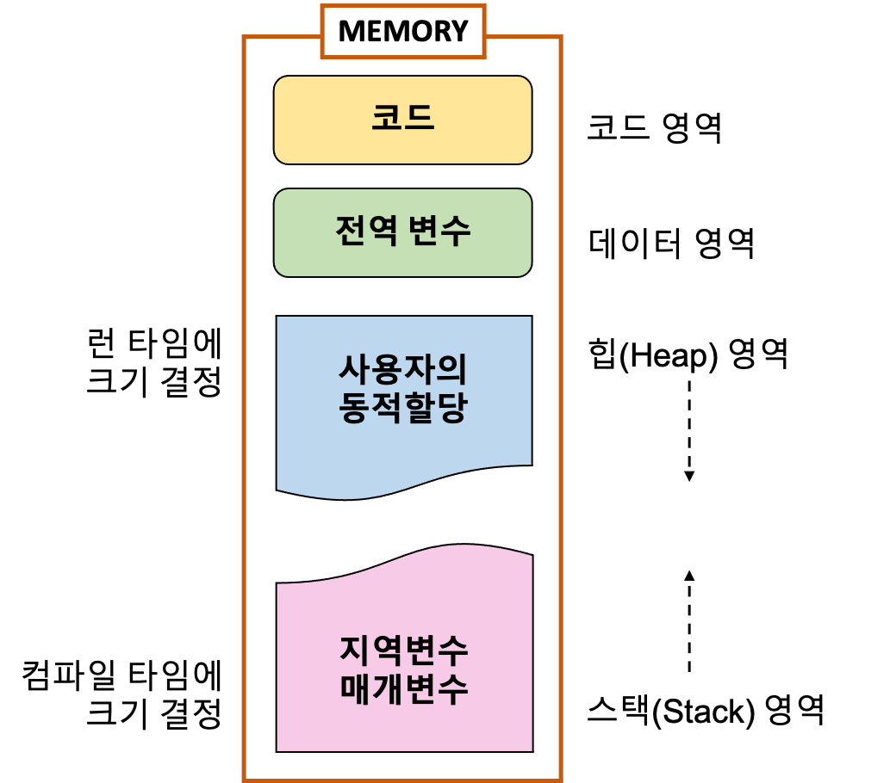

# 📅 2025/05/13
# 프로세스(Process)와 스레드(Thread)의 차이는 무엇인가요?

## 프로세스(Process)
- **프로세스**는 운영체제에서 자원을 할당받는 **작업의 단위**로, 서로 메모리를 독립적으로 가진다.

## 스레드(Thread)
- **스레드**는 코드 **실행 흐름의 단위**로, 하나의 프로세스 안에 여러 스레드가 존재하며 같은 메모리를 공유한다.


| 항목 | 프로세스 (Process) | 스레드 (Thread) |
|------|----------------------|-------------------|
| 정의 | 실행 중인 프로그램의 인스턴스 | 프로세스 내에서 실행되는 작업의 흐름 |
| 메모리 공간 | 독립된 메모리 공간 사용 | 프로세스 내 자원을 공유 |
| 자원 공유 | 서로 자원 공유 불가 | 메모리, 파일, 자원 공유 |
| 생성 비용 | 상대적으로 큼 | 상대적으로 작음 |
| 안정성 | 하나의 프로세스가 종료되어도 다른 프로세스에는 영향 없음 | 하나의 스레드가 문제 생기면 전체 프로세스에 영향 줄 수 있음 |
| 예시 | Chrome 브라우저의 여러 창 | Chrome의 각 탭에서 작동하는 스레드 |


--- 

# 스레드를 사용하면 어떤 이점이 있나요? 단점은요?

## 스레드(Thread)의 장점
1. 응답성(성능) 향상 : 스레드 간의 작업 분할과 병렬 처리로 인해 사용자가 응용 프로그램을 원활하게 사용하는데 빠른 응답성(결과)를 제공할 수 있다
2. 자원 공유 효율성 향상 : 스레드는 하나의 프로세스 내에서 실행되기 때문에, 프로세스의 자원을 공유하여 접근할 수 있다. 그리고 스레드는 프로세스 내부에 있기 때문에 별도의 메모리 공간을 할당할 필요없이, 프로세스 내부에서 데이터를 관리하면 된다. (thread stack 공간에서 데이터 관리)
3. 동시성 : 여러 개의 스레드가 동시에 실행될 수 있어서, **작업 병렬 처리 가능**
4. 간결성 : 작업을 분리할 수 있어 코드가 간결해질 수 있다

## 스레드(Thread)의 단점
1. 스레드 간의 상호간섭 : 멀티 스레드(여러 스레드 사용)가 실행 중인 상황에, 스레드 간의 상호간섭 문제가 발생할 수 있다. 프로세스는 한 개가 다운되면, 그 프로세스만 작업이 멈추고 다른 프로세스에는 영향이 가지 않는다. 하지만 스레드는 다른 스레드가 작업을 방해하거나, 스레드간의 우선 순위 설정에 문제가 있을 경우 **서로에게 영향을 미치기 때문에** 예상치 못한 이슈 발생
2. 성능 저하 : 스레드를 많이 생성하면 성능 저하가 발생할 수 있다. 스레드들이 병렬로 실행되기 위해 컨텍스트 스위칭이 빈번하게 발생하기 때문
3. 동기화 이슈 : **여러 스레드가 공유 자원에 동시에 접근할 때, 동기화 문제 발생 가능**
4. 자원 소비 : 스레드는 개별적인 실행 흐름을 가지기 때문에, 스레드마다 stack 및 레지스터 등의 메모리 자원을 소비한다. 따라서 스레드의 수가 증가하면 메모리 사용량도 증가하게 되어 시스템 자원이 한계에 도달할 수 있다

# 멀티스레딩 환경에서 주의해야 할 점은 무엇인가요? (예: race condition, deadlock)

## Race Condition(경쟁 상태)
- 여러 스레드가 공유 자원에 동시에 접근하여 실행 결과가 접근 순서에 따라 달라지는 현상
- => 해결 방법 : Semaphore, Atomic 연산 활용, Lock 메커니즘 구현

```java
public class Counter {
    private int count = 0;
    
    // 동기화 없음 - Race Condition 발생 가능
    public void increment() {
        count++;
    }
    
    // 동기화 적용 - Race Condition 방지
    public synchronized void safeIncrement() {
        count++;
    }
    
    public int getCount() {
        return count;
    }
}
```

## Deadlock (교착상태)
- 두 개 이상의 스레드가 서로 상대방의 작업이 끝나기를 기다리며 무한정 대기하는 상태
- => 해결 방법 : 자원 할당 순서 정하기(순환 대기 방지), 타임아웃 설정(무한 대기 방지), 데드락 감지 및 복구 메커니즘 구현

```java
public class DeadlockExample {
    private static final Object resource1 = new Object();
    private static final Object resource2 = new Object();

    // 데드락 발생 가능성 있는 코드
    public static void deadlockRisk() {
        Thread t1 = new Thread(() -> {
            synchronized(resource1) {
                System.out.println("Thread 1: resource1 잠금");
                try { Thread.sleep(100); } catch (InterruptedException e) {}
                synchronized(resource2) {
                    System.out.println("Thread 1: resource2 잠금");
                }
            }
        });
        
        Thread t2 = new Thread(() -> {
            synchronized(resource2) {
                System.out.println("Thread 2: resource2 잠금");
                try { Thread.sleep(100); } catch (InterruptedException e) {}
                synchronized(resource1) {
                    System.out.println("Thread 2: resource1 잠금");
                }
            }
        });
        
        t1.start();
        t2.start();
    }
    
    // 데드락 방지 코드 - 자원 획득 순서 통일
    public static void deadlockPrevention() {
        Thread t1 = new Thread(() -> {
            synchronized(resource1) {
                System.out.println("Thread 1: resource1 잠금");
                try { Thread.sleep(100); } catch (InterruptedException e) {}
                synchronized(resource2) {
                    System.out.println("Thread 1: resource2 잠금");
                }
            }
        });
        
        Thread t2 = new Thread(() -> {
            synchronized(resource1) {  // 순서 통일: 항상 resource1 먼저 잠금
                System.out.println("Thread 2: resource1 잠금");
                try { Thread.sleep(100); } catch (InterruptedException e) {}
                synchronized(resource2) {
                    System.out.println("Thread 2: resource2 잠금");
                }
            }
        });
        
        t1.start();
        t2.start();
    }
```


# 📅 2025/05/28
# 프로그램이 실행될 때 메모리 구조(스택, 힙, 데이터 영역, 코드 영역)를 설명해 주세요.
- 프로그램이 실행되기 위해선 먼저 프로그램이 메모리에 로드 되어야 한다. 
- 컴퓨터의 운영체제는 프로그램의 실행을 위해 다양한 메모리 공간을 제공하고, 각각의 메모리 공간은 상호 작용하며 프로그램 실행에 기여한다.





- 메모리 공간은(RAM) 크게 코드(Code), 데이터(Data), 스택(Stack), 힙(Heap) 영역으로 나뉜다.

- 코드(Code) 영역: 실행할 프로그램의 코드
- 데이터(Data) 영역: 전역 변수, 정적 변수
- 힙(Heap) 영역: 런타임 시 크기가 결정됨(사용자의 동적 할당)
- 스택(Stack) 영역: 컴파일 타임에 크기가 결정됨

▶︎ 코드(Code) 영역
- 작성한 소스코드가 저장되는 영역으로 텍스트 영역이라고도 부른다.
- 기계어 형태(0,1)로 저장한다.
- 실행 파일을 구성하는 명령어들이 올라가는 메모리 영역으로 함수, 제어문, 상수 등이 여기에 지정된다.
- CPU는 코드 영역에 저장된 명령어들을 하나씩 가져가서 실행한다.

▶︎ 데이터(Data) 영역
- 전역 변수와 정적 변수(static)가 할당되는 영역이다.
- 메인 함수 전에 선언되어 프로그램의 시작과 동시에 할당되고 프로그램이 종료돼야 메모리가 소멸된다.

▶︎ 힙(Heap) 영역
- 이 공간에 메모리 할당하는 것을 동적 할당(Dynamic Memory Allocation) 이라고 부른다.
- 사용자에 의해 메모리 공간이 동적으로 할당되고 해제된다.
- 응용 프로그램이 종료될 때까지 메모리가 유지되기 때문에 사용하고 난 후 반드시 매모리 해제를 해줘야 한다.(memory leak 발생), 
Java에서는 가비지 컬렉터가 자동으로 해제한다
- 영역 중 유일하게 런타임시 크기가 결정
- 참조형(Reference Type) 데이터 타입을 갖는 객체(인스턴스), 배열 등이 저장되는 공간, 단 힙 영역에 있는 오브젝트들을 가리키는레퍼런스 변수는 스택에 적재
- 메모리의 낮은 주소부터 할당되는 선입선출(FIFO) 구조

▶︎ 스택(Stack) 영역
- 프로그램이 자동으로 사용하는 임시 메모리 영역
- 함수 호출 시 생성되는 지역 변수와 매개 변수가 저장되는 영역
- 함수 호출이 완료되면 저장된 메모리도 해제된다
- 메모리의 높은 주소부터 할당되는 후입선출(LIFO) 구조

Heap 영역과 Stack 영역은 사실 같은 공간을 공유한다. Heap이 메모리 위쪽 주소부터 할당되면 Stack은 아래쪽부터 할당되는 식이다. 그래서 각 영역이 상대 공간을 침범하는 일이 발생할 수 있는데, 이를 각각 Heap Overflow, Stack Overflow 라고 칭한다.

따라서 Stack 영역이 클수록 Heap 영역이 작아지고, Heap 영역이 크면 Stack 영역이 작아진다.

<br>

# Stack Overflow란 무엇인가요?
- **프로그램이 사용 가능한 스택 메모리(Stack Memory) 영역을 초과하여 더 이상 데이터를 쌓을 수 없게 되는 현상**
- 이로 인해 프로그램이 **비정상적으로 종료** 되거나 **시스템 에러**가 발생

## Stack Overflow의 원인
1. 무한 재귀 호출 (Recursive Call)
- 재귀 함수가 종료되지 않고 무한히 호출될 때
- 재가 함수는 자기 자신을 호출하면서 매번 새로운 스택 프레임(Stack Frame)을 쌓겓 ㅚ는데, 종료 조건 없이 계속 호출되면 스택에 계속 쌓이게 되어 스택 메모리를 초과하게 됨

2. 지나치게 깊은 함수 호출 체인
- 여러 함수가 서로 호출하는 상황에서도 스택 오버플로우 발생
- ex) A() 함수가 B() 함수 호출, B()함수가 C() 호출..  

3. 너무 큰 로컬 변수 할당
- 함수 내부에서 너무 큰 크기의 배열이나 객체를 로컬 변수로 선언할 때에도 발생할 수 있음
- 스택(Stack)은 보통 크기가 제한된 메모리 영역이기 때문에, 너무 많은 메모리를 사용하는 로컬 변수를 선언하면 스택 메모리를 초과하게 된다.


<br>

# Heap 메모리는 언제 사용하나요?
- 힙 영역은 사용자가 직접 관리할 수 있는 메모리 영역. 사용자에 의해 메모리 공간이 동적으로 할당되고 해제
- **실행 시간에 크기가 결정되는 데이터 구조**: 배열, 객체, 연결 리스트 등 프로그램이 실행되는 동안 필요한 크기가 변하거나, 미리 정확한 크기를 알 수 없는 데이터들을 저장할 때 힙 메모리를 사용합니다.
- **생존 주기가 함수 호출을 넘어가는 데이터**: 지역 변수와 달리, 함수가 종료된 후에도 계속 유지되어야 하는 데이터는 힙 메모리에 할당됩니다. 예를 들어, 객체의 인스턴스는 프로그램이 명시적으로 해제할 때까지 힙 메모리에 남아있습니다.
- **큰 크기의 데이터**: 스택 메모리는 크기에 제한이 있는 반면, 힙 메모리는 상대적으로 큰 데이터를 저장하는 데 적합합니다.


# 📅 2025/06/12
# 메모리 누수(Memory Leak)는 왜 발생하고, 어떻게 방지하나요?
- **메모리 누수(Memory Leak)**는 프로그램이 더 이상 필요하지 않은 메모리 공간을 운영 체제에 반환하지 않거나, 반환하지 못하여 해당 메모리 공간이 계속 점유된 상태로 남아있는 현상입니다. 시간이 지남에 따라 사용 가능한 메모리 양이 점차 줄어들어, 결국 시스템 성능 저하, 프로그램 충돌 또는 시스템 전체의 다운으로 이어질 수 있습니다.

## 메모리 누수 방지 방법
1. 더 이상 필요 없는 객체 참조 해제
- 컬렉션에서 객체 제거
- 참조 변수 `null` 할당
- 약한 참조(Weak Reference) 활용
- 이벤트 리스너/콜백 등록 해제

2. 자원 명시적 해제
- `try-with-resources` 사용
- `finally` 볼록에서 자원 해제 : `close()` 메서드를 호출하여 자원을 명시적으로 해제

3. 효율적인 캐시 관리
- 캐시 만료 정책 설정 (TTL)
- 메모리 캐시 라이브러리 사용

4. 정적(Static) 멤버 변수 주의

5. 프로파일링 도구 활용
- 메모리 프로파일링(Memory Profiling) 도구를 사용하여 런타임 중 객체 생성, 메모리 사용량, 가비지 컬렉션 활동 등을 모니터링


# 운영체제의 스케줄링 알고리즘에는 어떤 것들이 있나요? (FCFS, SJF, RR 등)
- 운영체제의 스케줄링 알고리즘은 CPU가 여러 프로세스(또는 스레드)를 어떤 순서로 실행할지 결정하는 방법을 정의합니다. 목표는 CPU 활용률을 높이고, 응답 시간을 줄이며, 처리량을 극대화하고, 공정성을 유지하는 것입니다. 
- 스케줄링은 크게 **선점(Preemptive)** 방식과 **비선점(Non-preemptive)** 방식으로 나뉨

## 주요 스케쥴링 알고리즘
1. FCFS (First-Come, First-Served) / FIFO (First-In, First-Out) 
- 비선점
- 가장 먼저 CPU를 요청한 프로세스가 가장 먼저 CPU를 할당받는 방식. 큐(Queue)와 같이 선입선출 방식으로 작동
- ex)은행 업무 대기열

2. SJF(Shortest Job First)
- 비선점(SJF) 또는 선점(SRTF)
- CPU 버스트 타임(CPU 사용 시간)이 가장 짧은 프로세스에게 먼저 CPU를 할당하는 방식
    - 비선점 SJF: 현재 실행 중인 프로세스가 완료될 때까지 CPU를 점유합니다.
    - 선점 SJF (SRTF): 현재 실행 중인 프로세스의 남은 시간이 새로운 도착 프로세스의 CPU 버스트 타임보다 길면, 새로운 프로세스가 CPU를 선점합니다.
- 평균 대기 시간과 평균 반환시간이 가장 짧다. 

3. RR(Round Robing)
- 선점
- 각 프로세스에게 **시간 할당량(Time Slice)**을 정의하여 CPU를 순차적으로 할당. 할당된 시간 내에 프로세스가 작업을 완료하지 못하면, CPU를 빼앗기고 큐의 맨 뒤로 이동하여 다음 차례를 기다린다.
- 공정성이 높다.
- 응답시간이 짧다.

4. 우선순위 스케쥴링(Priority Scheduling)
- 선점 또는 비선점
- 각 프로세스에 우선순위(정수 값)을 부여하고, 가장 높은 우선순위를 가진 프로세스에게 CPU를 할당한다
    - 선점 : 더 높은 우선순위의 프로세스가 도착하면 현재 실행 중인 프로세스를 중단시키고 CPU를 선점
    - 비선점 : 현재 실행 중인 프로세스가 완료되거나 대기 상태가 될 때까지 기다린다
 

# Context Switching이란 무엇인가요? 왜 발생하나요?
- **컨텍스트 스위칭(Context Switching)**은 운영체제(OS)의 커널이 **CPU를 현재 실행 중인 프로세스(또는 스레드)에서 다른 프로세스(또는 스레드)로 전환할 때 발생하는 작업**을 의미합니다. 
- 간단히 말해, CPU가 어떤 작업을 하다가 다른 작업을 시작해야 할 때, 원래 하던 작업의 상태를 저장하고 새로운 작업의 상태를 로드하는 과정입니다.


## Context Switching은 왜 발생하나요?
- 컨텍스트 스위칭은 운영체제가 여러 프로세스(또는 스레드)를 동시에 실행하는 것처럼 보이게 하는(시분할 멀티태스킹) 핵심적인 메커니즘이기 때문에 발생합니다. 즉, 제한된 CPU 자원을 효율적으로 여러 작업에 분배하고 관리하기 위해 필수적으로 일어납니다.
1. 시분할(Time Sharing) / 다중 프로그래밍(Multiprogramming)
2. 인터럽트(Interrupt) 발생
3. 시스템 호출(System Call)
4. I/O 대기(Waiting for I/O)
5. 멀티스레딩(Multi-threading)

