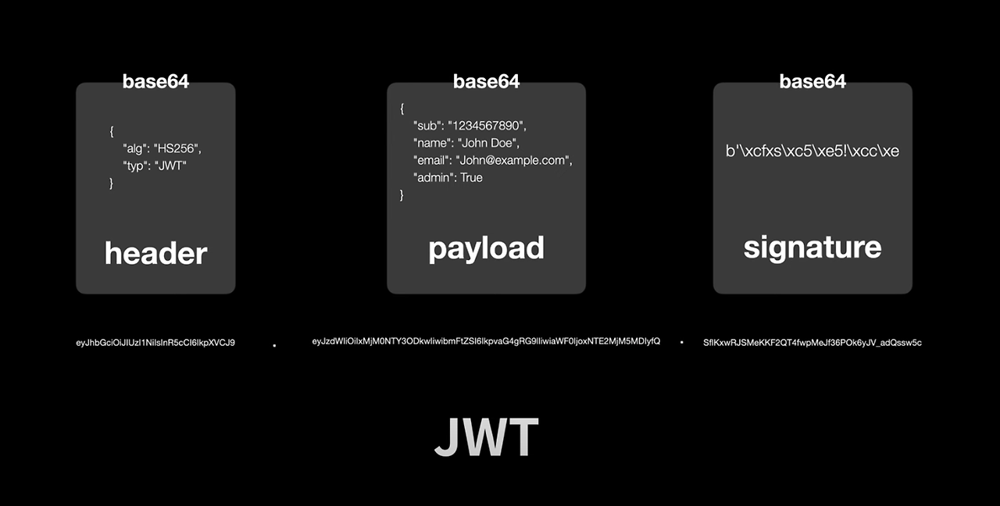

# 📅 2025/05/16
# HTTP 상태코드 3xx, 4xx, 5xx는 각각 무엇을 의미하나요? 4xx 중 401과 403의 차이는?
1. 1XX: Informational(정보 제공)
- 임시 응답으로 현재 클라이언트의 요청까지는 처리되었으니 계속 진행하라는 의미입니다. HTTP 1.1 버전부터 추가되었습니다
2. 2XX: Success(성공)
- 클라이언트의 요청이 서버에서 성공적으로 처리되었다는 의미입니다.
3. 3XX: Redirection(리다이렉션)
- 완전한 처리를 위해서 추가 동작이 필요한 경우입니다. 주로 서버의 주소 또는 요청한 URI의 웹 문서가 이동되었으니 그 주소로 다시 시도하라는 의미입니다.
4. 4XX: Client Error(클라이언트 에러)
- 없는 페이지를 요청하는 등 클라이언트의 요청 메시지 내용이 잘못된 경우를 의미합니다.
5. 5XX: Server Error(서버 에러)
- 서버 사정으로 메시지 처리에 문제가 발생한 경우입니다. 서버의 부하, DB 처리 과정 오류, 서버에서 익셉션이 발생하는 경우를 의미합니다.

## 401과 403의 차이
1. 401(Unauthorized	권한 없음) : 지정한 리소스에 대한 액세스 권한이 없다.
- 응답 헤더 WWW-Authenticate에 필요한 인증 방식을 지정합니다.
2. 403(Forbidden 금지됨) : 지정한 리소스에 대한 액세스가 금지되었다.
- 401 인증 처리 이외의 사유로 리소스에 대한 액세스가 금지되었음을 의미합니다. 리소스의 존재 자체를 은폐하고 싶은 경우는 404 응답 코드를 사용할 수 있습니다.

# Keep-Alive가 무엇인가요? 왜 필요한가요?
## HTTP Keep-Alive란?
- HTTP/1.1에서 기본으로 지원하는 **지속 연결(Persistent Connection).**
한 번 TCP 연결을 맺으면, 그 연결을 계속 유지하면서 여러 요청/응답을 처리할 수 있도록 해준다
- HTTP/1.0 시절에는 요청-응답이 끝날 때마다 TCP 연결을 끊었다. 리소스를 여러 개 요청하려면 그만큼 3-way handshake(연결 수립 과정)을 매번 수행해야 하니, 오버헤드가 컸다.
- 한 번 연결이 맺히면, Connection: keep-alive 헤더를 사용해 특정 시간 동안 연결을 닫지 않는다. 그동안은 추가 요청이 있으면 **새로운 TCP 연결을 맺을 필요 없이** 기존 연결을 재활용 한다.

## 왜 필요한가?
1. TCP 연결 비용 절감
- 3-way handshake를 자주 할 필요가 없다. 여러 개의 작은 리소스(이미지, CSS, JS 등)를 다운로드할 때, 한 번 연결로 연속해서 요청/응답을 주고받을 수 있다.
2. 네트워크 성능 향상
- 매번 연결-해제 과정을 반복하지 않으니, 지연(Latency)이 줄어든다.
- 브라우저나 서버 측 리소스 소모도 최소화 할 수 있다
3. UX 개선
- 웹 페이지 로딩 속도가 좀 더 빨라져서 사용자 경험이 좋아진다.
- 동시 접속자가 많은 웹 서비스에서도 연결 비용 부담을 줄여서 좀 더 매끄러운 통신을 제공한다.

## 그래도 "연결 유지"가 무조건 좋은가?
- **동시 접속**이 매우 많은 환경에서 Keep-Alive를 너무 오랫동안 유지하면, **서버 소켓**이 계속 점유되어 서버 부담이 커질 수 있다.
- **Short-Lived** API(한 번 요청 후 거의 다시 안 쓰는 API)나, 대용량 파일 업로드 시에도 적절히 고려가 필요하다.
→ 그래서 대형 사이트들은 **적절한 최적화 & 로드 밸런싱**으로 Keep-Alive와 서버 리소스를 함께 관리한다.

# JWT(Json Web Token)의 구조와 장단점을 설명해주세요.
## JWT란?
- JSON WEB TOKEN의 약자로 속성 정보 (Claim)를 JSON 데이터 구조로 표현한 토큰으로서 네트워크를 통해서 서로 다른 장치끼리 안전하게 전송하기 위해 설계됨

## 구성요소

1. 헤더 (Header) : 해시 암호화 알고리즘과 토큰의 타입으로 구성
- 첫 번째는 HMAC, SHA256 또는 RSA와 같은 서명 생성에 사용된 해시 알고리즘
- 두 번째는 토큰의 유형 (JWT)

2. 페이로드 (Payload) : 내용, 즉 토큰에 담을 클레임(Claim) 정보를 포함
- Payload 에 담는 정보의 한 ‘조각’ 을 클레임이라고 부르며, name / value 의 한 쌍으로 이뤄짐
- 토큰에는 여러개의 클레임 들을 넣을 수 있음
- 클레임의 정보는 등록된 (registered) 클레임, 공개 (public) 클레임, 비공개 (private) 클레임으로 세 종류가 있음

3. 서명 (Sinature)으로 구성
- Header, Payload, Secret Key를 합쳐 암호화한 결과값
- HS256( base64UrlEncode(header) + "." + base64UrlEncode(payload), Secret key)

## JWT 장점
- 토큰 자체가 인증된 정보이기때문에 세션 저장소 같은 별도의 인증 저장소가 필수적으로 필요하지 않음
- 세션과 다르게 클라이언트 상태를 서버가 저장하지 않아도 됨
- signature를 공통키 개인키 암호화를 통해 막아두었기 때문에 데이터 보안성이 늘어남
- 필요한 내용을 payload에 담아 보내 놓고 다시 조회할 일이 없어 서버의 부담이 완화됨
- 로그인할때 한번만 인증하면되어 DB조회를 한번만 함

## JWT 단점
- 토큰은 클라이언트에 저장되어 데이터베이스에서 사용자 정보를 조작하더라도 토큰에 직접 적용할 수 없음
- 더 많은 필드가 추가되면 토큰이 커질 수 있고 이는 네트워크에 부하를 줄 수 있음
- 비상태 애플리케이션에서 토큰은 거의 모든 요청에 대해 전송되므로 데이터 트래픽 크기에 영향을 미칠 수 있음
- JWT는 상태를 저장하지 않기 때문에 한번 만들어지면 제어가 불가능함. 즉, 토큰을 임의로 삭제하는 것이 불가능하므로 토큰 만료 시간을 꼭 넣어주어야 함
-  Payload 자체는 암호화 된 것이 아니라, BASE64Url로 인코딩 된 것. 따라서 중간에 Payload를 탈취하여 디코딩하면 데이터를 볼 수 있으므로, JWE로 암호화하거나 Payload에 중요 데이터를 넣지 않아야 하며 토큰 만료 시간을 짧게 지정해야함