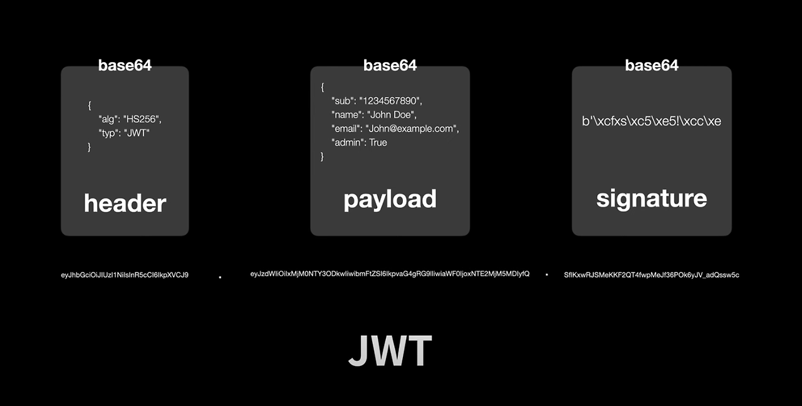
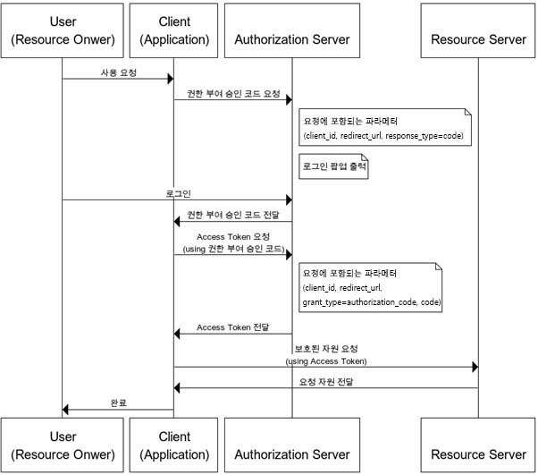
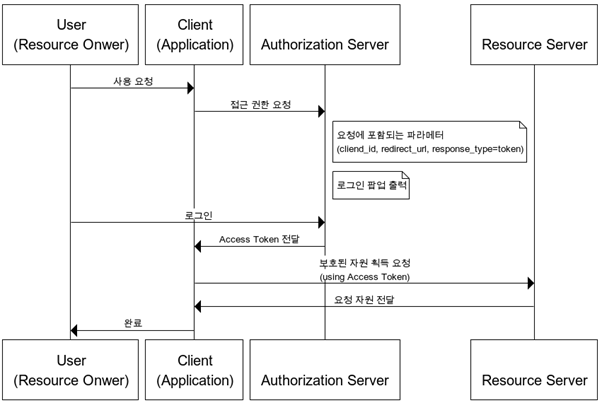
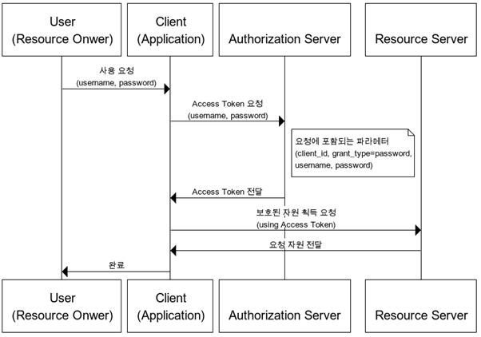
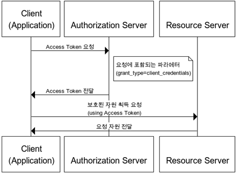

# 📅 2025/05/16
# HTTP 상태코드 3xx, 4xx, 5xx는 각각 무엇을 의미하나요? 4xx 중 401과 403의 차이는?
1. 1XX: Informational(정보 제공)
- 임시 응답으로 현재 클라이언트의 요청까지는 처리되었으니 계속 진행하라는 의미입니다. HTTP 1.1 버전부터 추가되었습니다
2. 2XX: Success(성공)
- 클라이언트의 요청이 서버에서 성공적으로 처리되었다는 의미입니다.
3. 3XX: Redirection(리다이렉션)
- 완전한 처리를 위해서 추가 동작이 필요한 경우입니다. 주로 서버의 주소 또는 요청한 URI의 웹 문서가 이동되었으니 그 주소로 다시 시도하라는 의미입니다.
4. 4XX: Client Error(클라이언트 에러)
- 없는 페이지를 요청하는 등 클라이언트의 요청 메시지 내용이 잘못된 경우를 의미합니다.
5. 5XX: Server Error(서버 에러)
- 서버 사정으로 메시지 처리에 문제가 발생한 경우입니다. 서버의 부하, DB 처리 과정 오류, 서버에서 익셉션이 발생하는 경우를 의미합니다.

## 401과 403의 차이
1. 401(Unauthorized	권한 없음) : 지정한 리소스에 대한 액세스 권한이 없다.
- 응답 헤더 WWW-Authenticate에 필요한 인증 방식을 지정합니다.
2. 403(Forbidden 금지됨) : 지정한 리소스에 대한 액세스가 금지되었다.
- 401 인증 처리 이외의 사유로 리소스에 대한 액세스가 금지되었음을 의미합니다. 리소스의 존재 자체를 은폐하고 싶은 경우는 404 응답 코드를 사용할 수 있습니다.

# Keep-Alive가 무엇인가요? 왜 필요한가요?
## HTTP Keep-Alive란?
- HTTP/1.1에서 기본으로 지원하는 **지속 연결(Persistent Connection).**
한 번 TCP 연결을 맺으면, 그 연결을 계속 유지하면서 여러 요청/응답을 처리할 수 있도록 해준다
- HTTP/1.0 시절에는 요청-응답이 끝날 때마다 TCP 연결을 끊었다. 리소스를 여러 개 요청하려면 그만큼 3-way handshake(연결 수립 과정)을 매번 수행해야 하니, 오버헤드가 컸다.
- 한 번 연결이 맺히면, Connection: keep-alive 헤더를 사용해 특정 시간 동안 연결을 닫지 않는다. 그동안은 추가 요청이 있으면 **새로운 TCP 연결을 맺을 필요 없이** 기존 연결을 재활용 한다.

## 왜 필요한가?
1. TCP 연결 비용 절감
- 3-way handshake를 자주 할 필요가 없다. 여러 개의 작은 리소스(이미지, CSS, JS 등)를 다운로드할 때, 한 번 연결로 연속해서 요청/응답을 주고받을 수 있다.
2. 네트워크 성능 향상
- 매번 연결-해제 과정을 반복하지 않으니, 지연(Latency)이 줄어든다.
- 브라우저나 서버 측 리소스 소모도 최소화 할 수 있다
3. UX 개선
- 웹 페이지 로딩 속도가 좀 더 빨라져서 사용자 경험이 좋아진다.
- 동시 접속자가 많은 웹 서비스에서도 연결 비용 부담을 줄여서 좀 더 매끄러운 통신을 제공한다.

## 그래도 "연결 유지"가 무조건 좋은가?
- **동시 접속**이 매우 많은 환경에서 Keep-Alive를 너무 오랫동안 유지하면, **서버 소켓**이 계속 점유되어 서버 부담이 커질 수 있다.
- **Short-Lived** API(한 번 요청 후 거의 다시 안 쓰는 API)나, 대용량 파일 업로드 시에도 적절히 고려가 필요하다.
→ 그래서 대형 사이트들은 **적절한 최적화 & 로드 밸런싱**으로 Keep-Alive와 서버 리소스를 함께 관리한다.

# JWT(Json Web Token)의 구조와 장단점을 설명해주세요.
## JWT란?
- JSON WEB TOKEN의 약자로 속성 정보 (Claim)를 JSON 데이터 구조로 표현한 토큰으로서 네트워크를 통해서 서로 다른 장치끼리 안전하게 전송하기 위해 설계됨

## 구성요소

1. 헤더 (Header) : 해시 암호화 알고리즘과 토큰의 타입으로 구성
- 첫 번째는 HMAC, SHA256 또는 RSA와 같은 서명 생성에 사용된 해시 알고리즘
- 두 번째는 토큰의 유형 (JWT)

2. 페이로드 (Payload) : 내용, 즉 토큰에 담을 클레임(Claim) 정보를 포함
- Payload 에 담는 정보의 한 ‘조각’ 을 클레임이라고 부르며, name / value 의 한 쌍으로 이뤄짐
- 토큰에는 여러개의 클레임 들을 넣을 수 있음
- 클레임의 정보는 등록된 (registered) 클레임, 공개 (public) 클레임, 비공개 (private) 클레임으로 세 종류가 있음

3. 서명 (Sinature)으로 구성
- Header, Payload, Secret Key를 합쳐 암호화한 결과값
- HS256( base64UrlEncode(header) + "." + base64UrlEncode(payload), Secret key)

## JWT 장점
- 토큰 자체가 인증된 정보이기때문에 세션 저장소 같은 별도의 인증 저장소가 필수적으로 필요하지 않음
- 세션과 다르게 클라이언트 상태를 서버가 저장하지 않아도 됨
- signature를 공통키 개인키 암호화를 통해 막아두었기 때문에 데이터 보안성이 늘어남
- 필요한 내용을 payload에 담아 보내 놓고 다시 조회할 일이 없어 서버의 부담이 완화됨
- 로그인할때 한번만 인증하면되어 DB조회를 한번만 함

## JWT 단점
- 토큰은 클라이언트에 저장되어 데이터베이스에서 사용자 정보를 조작하더라도 토큰에 직접 적용할 수 없음
- 더 많은 필드가 추가되면 토큰이 커질 수 있고 이는 네트워크에 부하를 줄 수 있음
- 비상태 애플리케이션에서 토큰은 거의 모든 요청에 대해 전송되므로 데이터 트래픽 크기에 영향을 미칠 수 있음
- JWT는 상태를 저장하지 않기 때문에 한번 만들어지면 제어가 불가능함. 즉, 토큰을 임의로 삭제하는 것이 불가능하므로 토큰 만료 시간을 꼭 넣어주어야 함
-  Payload 자체는 암호화 된 것이 아니라, BASE64Url로 인코딩 된 것. 따라서 중간에 Payload를 탈취하여 디코딩하면 데이터를 볼 수 있으므로, JWE로 암호화하거나 Payload에 중요 데이터를 넣지 않아야 하며 토큰 만료 시간을 짧게 지정해야함

---
# 📅 2025/05/30
# JWT를 사용할 때 발생할 수 있는 보안 문제와 이를 해결하는 방법은 무엇인가요?
1. 비밀 키(Secret Key) 노출
- JWT의 서명을 검증하는 데 사용되는 비밀 키가 노출되면 공격자는 임의의 페이로드를 담은 유효한 JWT를 생성하여 시스템을 속일 수 있다.
- **안전한 저장** : 비밀 키는 코드 저장소에 직접 포함하지 않고, 환경 변수, 보안 저장소 또는 하드웨어 보안 모듈과 같이 안전한 곳에 보관해야 한다.
- **키 로테이션** : 주기적으로 비밀 키를 변경하여, 노출되었을 경우의 피해를 최소화한다

2. 취햑한 서명 알고리즘 사용
- `none` 알고리즘이나 더 이상 안전하지 않은 `SHA1`과 같은 취약한 서명 알고리즘을 사용하면 토큰의 무결성을 보장할 수 없다. 특히, `none` 알고리즘이 허용되면 서명 검증 없이 토큰이 수락될 수도 있다
- **강력한 알고리즘 사용** : `HS256`, `HSA384`, `HS512`와 같은 안전한 HMAC SHA-2 알고리즘이나 `RS256`, `ES256`과 같은 비대칭 알고리즘을 사용해야 한다
- **`none` 알고리즘 비활성화** : 프로덕션 환경에서는 none 알고리즘 사용을 엄격히 금지해야 한다

3. 토큰 가로채기(Token Hijacking) 및 재생 공격(Replay Attacks)
- JWT 자체가 암호화되지 않기 때문에 네트워크 통신 중 가로채기 당할 수 있다. 가로채기가 된 토큰은 공격자에 의해 재사용될 수 있다
- **HTTPS 사용** : 모든 통신에 HTTPS 를 적용하여 토큰이 전송되는 동안 암호화한다
- **짧은 만료 시간(Expiration Time)** : 토큰의 수명을 짧게 설정하여 토큰이 유출되더라도 악용될 수 있는 시간을 제한한다
- **추가적인 보안 메커니즘** : 필요에 따라 토큰에 일회성  값(nonce)를 포함시키거나, 클라이언트 측에 저장된 토큰에 대한 추가적인 검증 메커니즘을 도입하여 재생 공격을 방지할 수 있다

4. 페이로드의 민감한 정보 노출
- JWT는 서명될 뿐 암호화되지 않으므로, 페이로드에 담긴 정보는 Base64로 인코딩되어 누구나 쉽게 읽을 수 있습니다. 따라서 민감한 정보를 직접 페이로드에 담는 것은 위험합니다.
- **최소한의 정보만 포함**: 페이로드에는 필요한 최소한의 정보만 포함하고, 민감한 정보는 토큰 자체에 담기보다는 서버 측 세션 저장소 등에 보관하고 토큰에는 해당 세션의 식별자만 포함하는 방식을 고려합니다.
- **JWE (JSON Web Encryption) 사용**: 정말로 페이로드의 내용을 숨겨야 하는 경우에는 JWT 대신 JWE를 사용하여 페이로드를 암호화할 수 있습니다.

5. 클라이언트 측 저장의 보안 취약성
- JWT를 로컬 스토리지나 쿠키에 저장할 때 XSS(Cross-Site Scripting) 공격에 취약해질 수 있습니다. 악의적인 스크립트가 실행되면 토큰을 탈취할 수 있습니다.
- **HTTP-only 쿠키 사용**: JWT를 쿠키에 저장할 때는 HttpOnly 플래그를 설정하여 JavaScript에서 쿠키에 접근하는 것을 방지합니다.
- **SameSite 쿠키 속성 설정**: SameSite 속성을 Strict 또는 Lax로 설정하여 CSRF(Cross-Site Request Forgery) 공격의 위험을 줄입니다.
**보안 컨텍스트에서 작업**: 중요한 작업은 클라이언트 측 로직에만 의존하지 않고 항상 서버 측에서 검증해야 합니다.

# OAuth2.0 인증 플로우를 설명해주세요. OAuth2를 사용할 때 주의해야 할 점은?
- OAuth(Open Authorization) 2.0는 HTTP 기반의 인증을 위한 업계 표준 프로토콜입니다. 
- OAuth 2.0은 웹, 데스크톱, 모바일 애플리케이션이 사용자 이름과 비밀번호를 공유하지 않고도 제한된 리소스에 대한 접근 권한을 얻을 수 있도록 하는 권한 부여 프레임워크입니다. 
- Resource Owner (리소스 소유자): 리소스에 대한 접근 권한을 부여할 수 있는 사용자입니다.
- Client (클라이언트): 리소스에 접근하려는 애플리케이션입니다.
- Authorization Server (인증 서버): 리소스 소유자의 동의를 얻고 접근 토큰을 발급하는 서버입니다.
- Resource Server (리소스 서버): 보호된 리소스를 호스팅하는 서버입니다.

## 인증 방식
1. Authorization Code Grant 권한 부여 승인 코드 방식

- 권한 부여 승인 요청 시 response_type을 code로 지정하여 요청합니다. 
- 이후 클라이언트는 권한 서버에서 제공하는 로그인 페이지를 브라우저를 띄워 출력합니다. 
- 이 페이지를 통해 사용자가 로그인을 하면 권한 서버는 권한 부여 승인 코드 요청 시 전달받은 redirect_url로 Authorization Code를 전달합니다. 
- Authorization Code는 권한 서버에서 제공하는 API를 통해 Access Token으로 교환됩니다. 

2. Implicit Grant  암묵적 승인 방식
- 자격증명을 안전하게 저장하기 힘든 클라이언트(ex: JavaScript등의 스크립트 언어를 사용한 브라우저)에게 최적화된 방식입니다.
- 암시적 승인 방식에서는 권한 부여 승인 코드 없이 바로 Access Token이 발급 됩니다. Access Token이 바로 전달되므로 만료기간을 짧게 설정하여 누출의 위험을 줄일 필요가 있습니다. 
- Refresh Token 사용이 불가능한 방식이며, 이 방식에서 권한 서버는 client_secret를 사용해 클라이언트를 인증하지 않습니다. Access Token을 획득하기 위한 절차가 간소화되기에 응답성과 효율성은 높아지지만 Access Token이 URL로 전달된다는 단점이 있습니다.

- 권한 부여 승인 요청 시 response_type을 token으로 설정하여 요청합니다. 
- 이후 클라이언트는 권한 서버에서 제공하는 로그인 페이지를 브라우저를 띄워 출력하게 되며 로그인이 완료되면 권한 서버는 Authorization Code가 아닌 Access Token를 redirect_url로 바로 전달합니다.

3. Resource Owner Password Credentials Grant  자원 소유자 자격증명 승인 방식
- 간단하게 username, password로 Access Token을 받는 방식입니다. 

- 제공하는 API를 통해 username, password을 전달하여 Access Token을 받는 것입니다. 
- 중요한 점은 이 방식은 권한 서버, 리소스 서버, 클라이언트가 모두 같은 시스템에 속해 있을 때 사용되어야 하는 방식이라는 점입니다.

4. Client Credentials Grant 클라이언트 자격증명 승인 방식
- 클라이언트의 자격증명만으로 Access Token을 획득하는 방식입니다. 
- OAuth2의 권한 부여 방식 중 가장 간단한 방식으로 클라이언트 자신이 관리하는 리소스 혹은 권한 서버에 해당 클라이언트를 위한 제한된 리소스 접근 권한이 설정되어 있는 경우 사용됩니다.
- 이 방식은 자격증명을 안전하게 보관할 수 있는 클라이언트에서만 사용되어야 하며, Refresh Token은 사용할 수 없습니다.

##  OAuth 2.0 사용 시 주의해야 할 점

1. redirect_uri 검증: 인증 요청 시 전달되는 redirect_uri는 미리 등록된 값과 정확히 일치해야 합니다. 그렇지 않으면 권한 코드가 공격자의 서버로 유출될 수 있습니다.
2. client_secret 안전하게 관리: 클라이언트 시크릿은 클라이언트를 식별하고 접근 토큰을 요청할 때 사용되므로, 안전하게 관리해야 합니다. 프런트엔드 코드에 직접 노출시키면 안 됩니다.
3. HTTPS 사용: 모든 통신은 HTTPS를 통해 이루어져야 합니다. HTTP를 사용하면 권한 코드나 접근 토큰이 네트워크를 통해 평문으로 노출될 위험이 있습니다.
4. Scope 제한: 클라이언트가 요청하는 권한 범위를 최소한으로 제한해야 합니다. 불필요한 권한을 요구하지 않도록 설계해야 합니다.
5. 토큰 유출 방지: 접근 토큰은 민감한 정보이므로 클라이언트 측에 안전하게 저장해야 합니다. 로컬 스토리지보다는 HTTP-only 쿠키를 사용하는 것이 XSS 공격에 더 안전할 수 있습니다.
6. CSRF 방지: 권한 부여 요청 시 CSRF 공격을 방지하기 위해 state 파라미터를 사용해야 합니다. state 값은 요청 시 클라이언트가 7. 생성하여 인증 서버로 보내고, 콜백 시 동일한 값을 검증하는 방식으로 사용됩니다.
7. 취약한 Grant Type 피하기: 암시적 부여 방식 (implicit)이나 리소스 소유자 비밀번호 자격 증명 부여 방식 (password)은 보안 취약점이 있을 수 있으므로 가능한 피하고, 권한 코드 부여 방식 (authorization_code)을 사용하는 것이 권장됩니다.
8. 토큰 만료 시간 설정: 접근 토큰의 만료 시간을 적절하게 설정하여 토큰이 탈취되더라도 악용될 수 있는 시간을 제한해야 합니다. 필요에 따라 갱신 토큰을 함께 사용하여 새로운 접근 토큰을 발급받을 수 있도록 합니다.

 

# Session 기반 인증과 Token 기반 인증의 차이는 무엇인가요?

## Session 기반 인증
- 사용자가 로그인하면 서버는 세션 저장소에 해당 사용자의 세션 정보를 저장하고, 클라이언트에게 세션ID를 담은 쿠키를 발급.
- 이후 클라이언트가 요청을 보낼 때마다 쿠키에 담긴 세션ID를 서버에 전달하면, 서버는 이 ID를 통해 세션 저장소에서 사용자 정보를 확인하여 인증한다.

- **상태 유지**: 서버는 각 사용자의 세션 정보를 저장하므로 상태를 유지(Stateful)
- 장점 : 구현이 비교적 간단, 서버에서 세션을 무효화하여 강제로 로그아웃 처리하기 용이
- 단점 : 서버 확장이 어려움, CORS 환경에서 쿠키 기반 인증 방식은 추가적인 설정이 필요하거나 제약이 있을 수 있다

## Token 기반 인증
- 사용자가 로그인하면 서버는 사용자 정보를 기반으로 암호화된 토큰 (주로 JWT)을 생성하여 클라이언트에게 전달한다
- 클라이언트는 이 토큰을 저장해두고, 이후 요청을 보낼 때마다 토큰을 함께 전달한다 (주로 HTTP 헤더의 Authorization 필드에 Bearer 스키마로 포함)
- 서버는 토큰을 검증하여 사용자를 인증한다

- **상태 비저장**: 서버는 토큰 자체를 저장하지 않고, 토큰의 유효성만 검증하므로 상태를 유지하지 않는다(Stateless)
- 장점 : 서버 확장이 용이(각 요청이 토큰 자체로 인증되기 때문에 여러 대의 서버에서 독립적으로 처리 가능), CORS 환경에서 유연하게 사용 가능(토큰은 쿠키 없이도 헤더를 통해 전달 가능), 모바일 앱, 데스크톱 앱 등 다양한 클라이언트에서 일관됭 방식으로 인증 처리 할 수 있다
- 단점 : 토큰이 탈취될 경우 만료되기 전까지는 막을 방법이 어렵다 (만료 시간을 짧게 설정하여 완화), 서버에서 강제로 특정 토큰을 무효화하기가 세션 기반 방식보다 복잡할 수 있다 (별도의 블랙리스트 관리 등의 방식이 필요할 수 있음)

# 📅 2025/06/16
# 쿠키(Cookie)와 세션(Session)의 차이는 무엇인가요?
- 쿠키와 세션은 HTTP 프로토콜의 특징이자 약점을 보완하기 위해 사용한다.
- HTTP 프로토콜은 `비연결지향`과 `상태정보 유지 안함`이라는 특징을 가지고 있다.
- 따라서, 서버와 클라이언트가 통신을 할 때 통신이 연속적으로 이어지지 않고 한 번 통신이 되면 끊어진다.

# 쿠키(Cookie)
- HTTP의 일종으로 사용자가 어떤 웹 사이트를 방문할 경우, 해당 사이트가 사용하고 있는 서버에서 **사용자의 컴퓨터에 저장하는 작은 기록 정보 파일**
- HTTP 클라이언트의 상태정보를 쿠키 형태로 클라이언트 PC에 저장하였다가 **필요 시 정보를 참조하거나 재사용할 수 있다**

## 쿠키의 특징
- Key-Value 쌍으루 구성되어 있는 데이터 파일
- 쿠키 이름, 쿠키값, 만료시간, 전송할 도메인명, 전송할 경로, 보안연결여부, HttpOnly여부로 구성
- 도메인 당 20개의 쿠키를 가질 수 있다
- 하나의 쿠키는 4KB(=4096 byte)까지 저장 가능

## 쿠키의 사용목적
1. 세션 관리(Session Management)
    - 로그인, 사용자 닉네임, 접속 시간, 장바구니 등의 서버가 알아야할 정보를 저장
2. 개인화(Personalization)
    - 사용자마다 다르게 그 사람이 적절한 페이지를 보여줄 수 있다
3. 트래킹(Tracking)
    - 사용자의 행동과 패턴을 분석하고 기록

## 쿠키의 단점 
- 쿠키는 클라이언트에서 수정할 수 있기 때문에 위변조의 위험이 항상 존재한다. 
- 따라서 쿠키값(value)를 암호화해야 하며, 민감하거나 중요한 정보를 담지 않도록 해야한다.

# 세션(Session)
- 일정 시간 동안 같은 사용자(브라우저)로부터 들어오는 일련의 요구를 하나의 상태로 보고, 그 상태를 유지시키는 기술
- 여기서 일정 시간은 방문자가 웹 브라우저를 통해 웹 서버에 접속한 시점부터 웹 브라우저를 종료하여 연결을 끝내는 시점을 말한다.
- 즉, 브라우저가 종료되기 전까지 클라이언트의 요청을 유지하게 해주는 기술을 세션이라고 한다.

## 세션의 특징
- 웹 서버에 웹 컨테이너의 상태를 유지하기 위한 정보를 저장한다.
- 웹 서버에 저장되는 쿠키(세션 쿠키 / session cookie)이다.
- 브라우저를 닫거나, 서버에서 세션을 삭제했을 때만 삭제가 되기 때문에 쿠키보다 비교적 보안적으로 우수하다.
- 저장 데이터에 제한이 없다.(서버 용량 허용 범위 내에서)
- 각 클라이언트에 고유 세션 ID(Session ID)를 부여한다. 세션 ID를 통해 클라이언트를 구분하여 각 요구에 맞는 서비스를 제공한다.

## 세션의 사용목적
- 사용자나 다른 누군가에게 노출되면 안된느 보안적으로 중요한 정보들을 서버 안에서 다루기 위해 사용

## 세션의 단점
- 세션의 내용은 서버에 저장되기 때문에 계속하여 늘어날 경우 서버 부하 발생
- 또한, 세션에 대한 정보가 서버에 있어 쿠키에 비해 비교적 속도가 느림

# 쿠키 vs 세션

| 항목        | Cookie                          | Session                           |
|-------------|----------------------------------|-----------------------------------|
| 저장 위치   | Client                          | Server                            |
| 저장 형식   | Text                            | Object                            |
| 만료 시점   | 쿠키 저장 시 설정 (설정 없으면 브라우저 종료 시) | 정확한 시점 모름              |
| 리소스      | 클라이언트의 리소스              | 서버의 리소스                     |
| 용량 제한   | 한 도메인 당 20개, 한 쿠키 당 4KB | 제한 없음                         |
| 속도        | 쿠키에 정보가 있어 비교적 빠름    | 정보가 서버에 있어 비교적 느림   |

# 쿠키의 Secure, HttpOnly, SameSite 옵션은 각각 어떤 역할을 하나요?
## Secure 옵션
- 역할 : Secure 옵션이 설정된 쿠키는 **HTTPS 프로토콜을 통해서만 서버로 전송**된다. HTTP를 사용할 때는 브라우저가 이 쿠키를 서버에 보내지 않는다.
- 보안 이점 
    - 중간자 공격 방지: 네트워크를 통해 전송되는 쿠키가 암호화되지 않은 상태로 노출되는 것을 막아, 공격자가 쿠키를 가로채는 것을 방지
    - 민감한 정보가 평문으로 전송되어 유출되는 위험 감소
- 주의사항 : Secure 옵션은 HTTPS 환경에서만 의미가 있음, `localhost` 환경에서는 HTTP로도 통신이 가능하지만 실제 배포 환경에서는 반드시 `HTTPS`를 사용해야 한다

## HttpOnly 옵션
- 역할 : HttpOnly 옵션이 설정된 쿠키는 **자바스크립트의 `document.cookie`를 통한 접근을 차단**한다. 즉, 클라이언트 측 스크립트로 해당 쿠키를 읽거나 수정할 수 없다. 
- 보안 이점 
    - XSS(Cross-Site Scripting) 공격 방지 : XSS 공격은 악의적인 스크립트가 웹 페이지에 삽입되어 사용자의 쿠키를 탈취하는 것을 목표로 한다. HttpOnly 옵션을 사용하면 설령 XSS 공격에 성공하더라도 공격자가 쿠키 정보에 직접 접근하는 것을 막아 중요한 인증 정보나 세션 토큰이 유출되는 것을 방지
- 주의사항 : HttpOnly 쿠키도 여전히 HTTP 요청과 함께 서버로 전송되지만, 브라우저 내에서 자바스크립트에 의해 접근될 수 없다는 점에서 보안성이 높아진다.

## SameSite 옵션
- 역할 : SameSite 옵션은 **크로스 사이트(Cross-Site) 요청에서 쿠키가 전송되는 방식을 제어**, 이를 통해 CSRF 공격을 방지하는 데 도움을 준다 
- 옵션 값
    - Strict : 가장 엄격한 설정, 동일한 도메인(Same-site) 내에서 발생한 오퍼에게만 전송.
    - Lax : Strict보다 완화된 설정, 일부 안전한 요청(GET 메서드를 통한 외부 링크 클릭)에서는 쿠키 전송이 허용
    - None : 쿠키가 크로스 사이트 요청에서도 항상 전송됩니다. SameSite=None을 사용할 경우, 보안상의 이유로 반드시 Secure 옵션도 함께 설정해야 한다.
- 보안 이점 
    - CSRF (Cross-Site Request Forgery) 공격 방지: CSRF 공격은 사용자가 로그인된 상태에서 의도하지 않은 악의적인 요청을 보내도록 유도하는 공격. SameSite 옵션은 크로스 사이트 요청에서 쿠키 전송을 제한함으로써 이러한 공격을 효과적으로 방어할 수 있다
